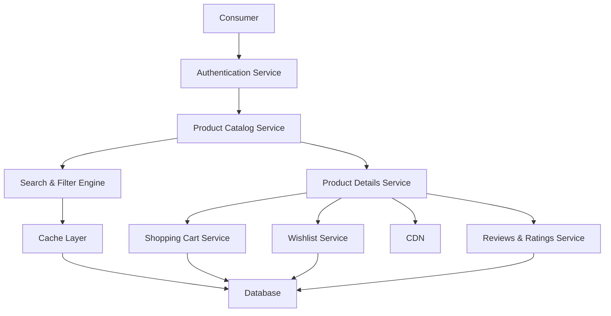

#### 1. High-Level Design

- **Summary:** This epic delivers the complete consumer shopping journey from product discovery to cart management. It provides intuitive product catalog browsing with search, filter, and sort capabilities, detailed product views with images and descriptions, shopping cart operations, wishlist functionality, and product reviews and ratings. The focus is on creating a seamless, engaging shopping experience that minimizes friction in product discovery and selection, ultimately reducing cart abandonment and increasing consumer satisfaction.

- **Component Flow:**

- **Integration Points:**
  - Cloud hosting and CDN services for fast content delivery of product images and static assets
  - Email notification providers for account confirmation and wishlist reminders
  - Third-party authentication services (OAuth providers) if social login is implemented
  - Search engine/indexing services for efficient product search and filtering

- **Key Assumptions:**
  - Product images are optimized and served via CDN with multiple resolutions for responsive design; search index is updated near real-time (within 5 seconds of product changes).
  - Shopping cart data persists for authenticated users across sessions; anonymous cart data expires after 24 hours of inactivity.

- **NFR Highlights:** Page load times must not exceed 2 seconds for 95% of requests, system must support up to 100,000 concurrent users, 99.9% uptime SLA, and platform must meet WCAG 2.1 AA accessibility standards with full keyboard and screen reader support.

- **Data Flow:** Consumer accesses the platform and optionally authenticates via the authentication service. The product catalog service retrieves product listings from the database, leveraging a cache layer for frequently accessed data. When consumers search or filter, the search & filter engine queries an optimized search index and returns results within milliseconds. Product images and static assets are delivered via CDN for fast load times. When viewing product details, the product details service aggregates information including images, descriptions, reviews, and ratings. Consumers can add items to their shopping cart (cart service persists data in the database) or wishlist (wishlist service). Reviews and ratings are stored and retrieved via the reviews & ratings service. All interactions are designed to meet the 2-second page load requirement through caching, CDN usage, and database optimization. The system scales horizontally to support 100,000 concurrent users and implements accessibility features including keyboard navigation and ARIA labels for screen readers.

#### 2. Validation Report

- **Requirements Coverage:** The design fully addresses all requirements in the epic's scope: user registration and authentication for buyers, product catalog with search and filter capabilities, product sorting and categorization, shopping cart management, product details with images and descriptions, product reviews and ratings, and wishlist functionality. All NFRs are accommodated: 2-second page load times achieved through CDN, caching, and optimized queries; support for 100,000 concurrent users via horizontal scaling and load balancing; 99.9% uptime SLA through redundant infrastructure and automated failover; WCAG 2.1 AA accessibility compliance with keyboard navigation and screen reader support. Dependencies on cloud hosting/CDN, email notification providers, and authentication services are explicitly integrated. The architecture prioritizes performance and user experience to reduce cart abandonment and increase satisfaction.