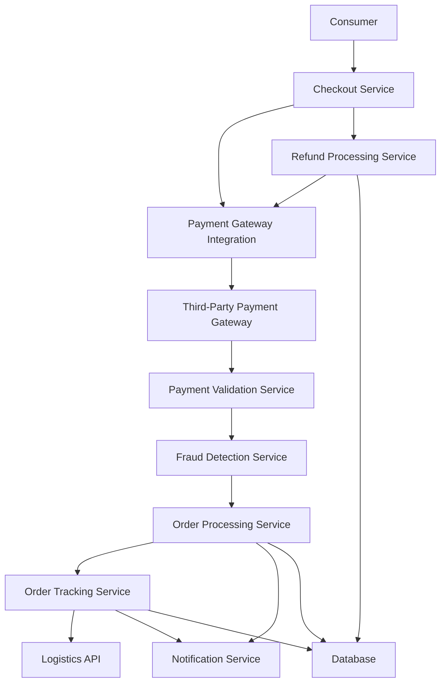

#### 1. High-Level Design

- **Summary:** This epic provides end-to-end secure transaction processing and order lifecycle management for consumers. It encompasses a secure checkout workflow with multiple payment method support, payment validation, order confirmation and tracking, real-time status updates, order cancellation and refund processing, and automated notifications throughout the order lifecycle. The system ensures PCI DSS compliance, encrypts all transaction data, and implements fraud detection to protect both consumers and the platform.

- **Component Flow:**

- **Integration Points:**
  - Third-party payment gateway APIs (credit card processors, PayPal) for payment processing
  - Email/SMS notification providers for order confirmations, status updates, and refund notifications
  - Third-party logistics APIs for shipping tracking and delivery status updates
  - Fraud detection services for transaction monitoring and risk assessment

- **Key Assumptions:**
  - Payment gateway supports tokenization for secure card storage; order status updates are event-driven with webhooks from logistics providers.
  - Refund processing follows standard payment gateway refund workflows with 5-7 business day settlement; fraud detection uses real-time scoring with configurable thresholds.

- **NFR Highlights:** Checkout process must complete within 5 seconds, all data encrypted in transit and at rest, PCI DSS compliance for payment processing, fraud detection with account lockout for suspicious activity, system must support 10,000 transactions per minute with horizontal scaling, and recovery from critical failures within 30 minutes.

- **Data Flow:** Consumer initiates checkout, providing payment details to the checkout service. Payment information is securely transmitted to the payment gateway integration layer, which communicates with third-party payment processors. Payment validation service verifies transaction details and fraud detection service assesses risk in real-time. Upon successful validation, order processing service creates the order record, stores it in the database, and triggers confirmation notifications via email/SMS. Order tracking service monitors order status by polling logistics APIs and pushes real-time updates to consumers through the notification service. For cancellations or refunds, the refund processing service initiates reverse transactions through the payment gateway and confirms completion to consumers. All transaction data is encrypted and logged for compliance and audit purposes.

#### 2. Validation Report

- **Requirements Coverage:** The design comprehensively covers all requirements specified in the epic: secure checkout workflow, multi-method payment integration (credit card, PayPal), order placement/confirmation, order status tracking and history, real-time notifications, order cancellation and refund processing, and payment validation with error handling. All NFRs are addressed: 5-second checkout completion through optimized service calls and caching, encryption for all data and transactions, PCI DSS compliance through payment gateway integration and tokenization, fraud detection with account lockout mechanisms, horizontal scaling to support 10,000 transactions per minute, and 30-minute recovery SLA through automated failover and monitoring. Dependencies on payment gateways, notification providers, and logistics APIs are explicitly integrated into the architecture.