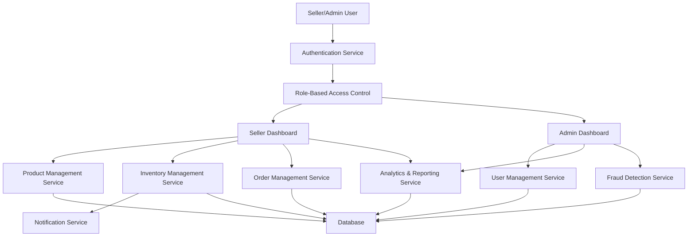

#### 1. High-Level Design

- **Summary:** This epic delivers comprehensive platform management capabilities for two distinct user roles: sellers who need tools to manage their product catalog, inventory, orders, and sales analytics; and administrators who require platform-wide monitoring, user management, dispute resolution, and compliance tools. The system implements role-based access control to ensure proper separation of permissions and supports platform scalability and security through fraud detection and compliance monitoring.

- **Component Flow:**

- **Integration Points:**
  - Cloud hosting services for dashboard and analytics infrastructure
  - Email/SMS notification providers for low inventory alerts and system notifications
  - Third-party fraud detection services for automated account verification and suspicious activity detection
  - Data analytics and reporting tools for KPI tracking and business intelligence

- **Key Assumptions:**
  - Product images will be stored in cloud object storage with CDN delivery; inventory updates are near real-time (within 1-2 seconds).
  - Fraud detection rules and thresholds will be configurable by administrators; dispute resolution workflows follow a standard escalation path.

- **NFR Highlights:** System must support up to 100,000 concurrent users with 99.9% uptime SLA, all user data encrypted, automated failover and backup mechanisms, WCAG 2.1 AA accessibility compliance, and fraud detection algorithms with automated account verification.

- **Data Flow:** Sellers authenticate and access their dashboard where they create/update product listings (images, descriptions) stored in the database and object storage. Inventory levels are tracked in real-time; when thresholds are breached, the notification service triggers low-stock alerts via email/SMS. Orders flow from the order management service to seller dashboards for fulfillment tracking. Sales data feeds the analytics service which generates reports and KPIs. Administrators access platform-wide analytics, manage user roles/permissions through the user management service, and monitor fraud detection alerts. All actions are logged and audited for compliance monitoring.

#### 2. Validation Report

- **Requirements Coverage:** The design fully addresses the epic's stated scope including seller registration/authentication, product and inventory management with notifications, order management, sales analytics, admin dashboard with role-based access control, platform analytics, dispute resolution, user management, and fraud detection. All NFRs are accommodated through the architecture: concurrent user support via horizontal scaling, encryption at rest and in transit, automated failover mechanisms, accessibility standards compliance, and fraud detection integration. Dependencies on cloud hosting, notification providers, fraud detection services, and analytics tools are explicitly mapped to system components.