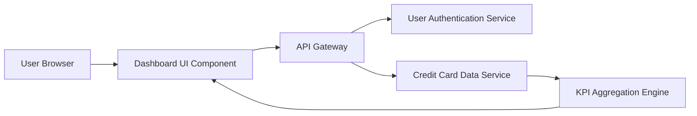

#### 1. High-Level Design

- **Summary:** This epic delivers a consolidated dashboard that displays key performance indicators (KPIs) for users' credit card portfolios. The dashboard aggregates and visualizes critical financial metrics including monthly spend, total credit limit, available credit, and outstanding amounts across all cards, providing users with instant visibility into their overall credit card financial health through a responsive interface.

- **Component Flow:**

- **Integration Points:**
  - **Upstream:** User Authentication Service (for user-specific portfolio access and session validation)
  - **Downstream:** Credit Card Data Service (for retrieving card details, balances, and real-time KPI data)

- **Key Assumptions:**
  - KPI data is refreshed via polling or push notifications from the Credit Card Data Service at regular intervals (e.g., every 30-60 seconds for real-time updates)
  - Card data is returned in JSON format with standardized field names for monthly spend, credit limit, available credit, and outstanding amounts

- **NFR Highlights:** Dashboard must load within 2 seconds; support responsive layouts across desktop, tablet, and mobile devices; support real-time data refresh for KPI metrics

#### 2. Validation Report

- **Requirements Coverage:** The design adequately covers all stated scope items including KPI display, monthly spend tracking, credit limit visualization, available credit calculation, outstanding amount display, multi-card consolidation, and responsive layout. The component flow demonstrates how user authentication, data retrieval, and aggregation support the dashboard functionality.

- **NFR Compliance:** The architecture supports the 2-second load time requirement through efficient API calls and aggregation. Responsive design is handled at the UI component level. Real-time refresh capability is enabled through the KPI Aggregation Engine.

- **Gap Analysis:** No significant gaps identified. All functional requirements and NFRs are addressed in the design.