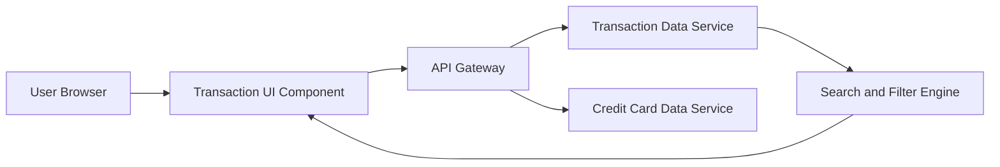

#### 1. High-Level Design

- **Summary:** This epic provides comprehensive transaction tracking and monitoring capabilities across all user credit cards. Users can view, search, filter, and analyze transactions in a centralized interface, enabling transparency and control over spending patterns. The feature supports card-wise segregation and advanced search/filter capabilities for up to 12 months of transaction history.

- **Component Flow:**

- **Integration Points:**
  - **Upstream:** Transaction Data Service (for fetching transaction records with pagination support)
  - **Upstream:** Credit Card Data Service (for linking transactions to specific cards and card metadata)

- **Key Assumptions:**
  - Transactions are stored with standardized attributes (date, amount, merchant, category, card ID) to enable effective search and filtering
  - Pagination is implemented with default page size of 50-100 transactions to handle large volumes efficiently

- **NFR Highlights:** Transaction retrieval API latency must be under 300ms; support pagination for large transaction volumes; handle transaction history for up to 12 months

#### 2. Validation Report

- **Requirements Coverage:** The design covers all core requirements including transaction listing, viewing across multiple cards, search and filtering capabilities, and card-wise segregation. The Search and Filter Engine component enables the required query capabilities while maintaining performance.

- **NFR Compliance:** The architecture supports sub-300ms API latency through optimized queries and indexing. Pagination is built into the Search and Filter Engine. The 12-month history requirement is a data retention policy handled by the Transaction Data Service.

- **Gap Analysis:** No significant gaps. The design addresses all functional and non-functional requirements specified in the epic.