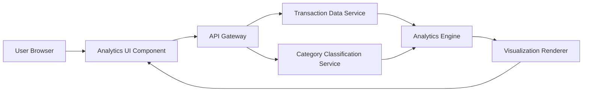

#### 1. High-Level Design

- **Summary:** This epic delivers interactive analytics and visualizations that enable users to understand spending patterns across categories and time periods. The feature provides monthly spend trend analysis, card-wise spend breakdowns, and category-wise distribution across nine predefined categories (Food & Dining, Fuel, Shopping, Travel, Entertainment, Utilities, Healthcare, Education, Miscellaneous). The analytics engine aggregates up to 24 months of historical data to generate actionable insights.

- **Component Flow:**

- **Integration Points:**
  - **Upstream:** Transaction Data Service (for raw transaction data across all cards)
  - **Upstream:** Category Classification Service (for transaction categorization into predefined categories)
  - **Upstream:** Analytics Engine (for data aggregation, trend calculation, and pattern identification)

- **Key Assumptions:**
  - Transactions are pre-categorized by the Category Classification Service or categorized on-demand during analytics processing
  - Analytics data is cached or pre-aggregated at monthly intervals to meet the 1.5-second rendering requirement for large datasets

- **NFR Highlights:** Analytics visualizations must render within 1.5 seconds; support interactive filtering and drill-down capabilities; handle data aggregation for up to 24 months of historical spending data

#### 2. Validation Report

- **Requirements Coverage:** The design comprehensively addresses all scope items including monthly spend trends, card-wise analysis, category-wise breakdown, interactive charts, and spending pattern identification. The multi-component architecture separates concerns for data retrieval, classification, aggregation, and visualization.

- **NFR Compliance:** The 1.5-second rendering requirement is supported through the Analytics Engine's pre-aggregation and caching strategies. Interactive filtering is handled by the Analytics UI Component with drill-down capabilities. The 24-month historical data requirement is managed through efficient data aggregation algorithms.

- **Gap Analysis:** No significant gaps identified. All functional requirements and NFRs are adequately addressed in the design.