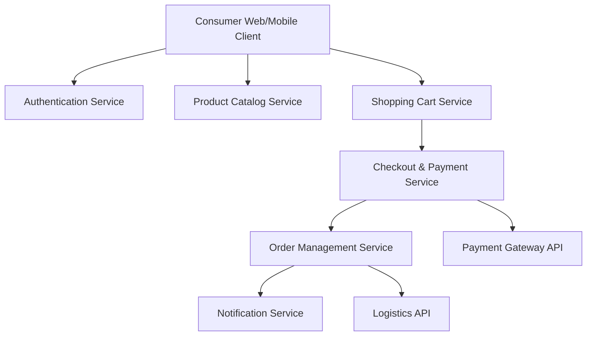

#### 1. High-Level Design

- **Summary**: This epic delivers the end-to-end consumer shopping experience, covering user authentication, product discovery with search/filter, shopping cart management, secure multi-payment checkout, order tracking with real-time notifications, and post-purchase capabilities including cancellations and refunds. The scope ensures a seamless, secure, and accessible shopping journey across web and mobile web platforms.

- **Component Flow**:

- **Integration Points**: 
  - Third-party payment gateway APIs for payment processing
  - Email/SMS notification providers for order updates and confirmations
  - Cloud hosting and CDN services for platform infrastructure
  - Third-party logistics APIs for automatic shipping updates

- **Key Assumptions**: 
  - Product data format and catalog schema will follow standard e-commerce JSON structures
  - Payment gateway supports all required payment methods (credit/debit cards, digital wallets) with standard REST APIs

- **NFR Highlights**: Page load <2s for 95% requests; checkout <5s; support 100K concurrent users and 10K transactions/min; PCI DSS compliance; 99.9% uptime; WCAG 2.1 AA accessibility

#### 2. Validation Report

- **Requirements Coverage**: The design fully addresses the epic's stated scope including authentication, catalog, cart, checkout, payment integration, order tracking, notifications, cancellations/refunds, reviews, and wishlist. All major functional requirements are covered through dedicated services with clear separation of concerns.

- **NFR Compliance**: Architecture supports horizontal scaling for 100K concurrent users; CDN usage ensures <2s page loads; asynchronous payment processing supports <5s checkout; encryption at rest and in transit meets PCI DSS; notification service enables real-time updates; cloud infrastructure with load balancing supports 99.9% uptime SLA.

- **Integration Validation**: All specified integrations are accounted for: payment gateway for transactions, notification providers for alerts, cloud/CDN for infrastructure, and logistics APIs for shipping updates. Standard REST API patterns assumed for all integrations.

- **Gap Analysis**: No critical gaps identified. Design covers all in-scope requirements. Out-of-scope items (native mobile apps, custom payment gateway, personalized recommendations) are appropriately excluded.