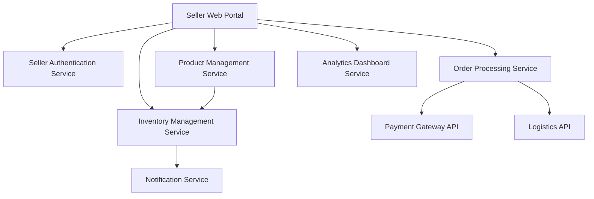

#### 1. High-Level Design

- **Summary**: This epic enables sellers to manage their business operations on the platform, including registration/authentication, product listing with media, inventory tracking with low-stock alerts, order fulfillment management, and sales analytics dashboards. The solution provides sellers with operational visibility and tools to respond to market demands efficiently.

- **Component Flow**:

- **Integration Points**: 
  - Cloud hosting and CDN services for platform infrastructure
  - Email/SMS notification providers for inventory alerts and order notifications
  - Third-party logistics APIs for shipping and fulfillment updates
  - Payment gateway APIs for seller payment processing

- **Key Assumptions**: 
  - Product images stored in cloud object storage with CDN delivery; standard formats (JPEG, PNG) with size limits
  - Inventory updates occur in near real-time with eventual consistency acceptable for analytics

- **NFR Highlights**: Support 100K concurrent users with horizontal scaling; seller dashboard loads <2s; automated fraud detection with account lockout; data encryption; 99.9% uptime; recovery from critical failures within 30 minutes

#### 2. Validation Report

- **Requirements Coverage**: The design comprehensively covers seller registration/authentication, product listing with images, inventory management with alerts, order processing, sales analytics, and catalog management. All functional requirements are addressed through dedicated microservices with clear responsibilities.

- **NFR Compliance**: Horizontally scalable architecture supports 100K concurrent users; caching and optimized queries ensure <2s dashboard loads; fraud detection service monitors seller activities; encryption at rest and in transit for all seller data; cloud infrastructure with automated failover supports 99.9% uptime and 30-minute recovery SLA.

- **Integration Validation**: All specified integrations are incorporated: cloud/CDN for infrastructure, notification providers for alerts, logistics APIs for fulfillment tracking, and payment gateway for seller payouts. Standard API contracts assumed for third-party integrations.

- **Gap Analysis**: No critical gaps identified. Design addresses all in-scope requirements. Out-of-scope items (direct logistics management, custom payment gateway, advanced marketing tools) are appropriately excluded per epic definition.