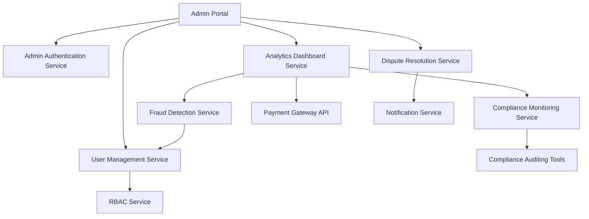

#### 1. High-Level Design

- **Summary**: This epic provides administrators with comprehensive tools to monitor platform health, manage users with role-based access control, resolve disputes, detect/prevent fraud, and ensure compliance. The solution enables oversight of all platform activities, permission management, escalation handling, fraud response, and regulatory compliance monitoring to maintain platform integrity and trust.

- **Component Flow**:

- **Integration Points**: 
  - Cloud hosting and CDN services for platform infrastructure
  - Email/SMS notification providers for admin alerts and user notifications
  - Payment gateway APIs for transaction monitoring
  - Compliance auditing tools for regulatory requirements

- **Key Assumptions**: 
  - Fraud detection uses machine learning models with configurable thresholds; manual review queue for edge cases
  - Compliance reporting follows standard audit log formats with retention policies per regional requirements

- **NFR Highlights**: Support 100K concurrent users; admin dashboard loads <2s; automated fraud detection with account lockout; PCI DSS compliance; regional data privacy law compliance; 99.9% uptime; automated failover and backup; recovery within 30 minutes

#### 2. Validation Report

- **Requirements Coverage**: The design fully addresses admin dashboard analytics, role-based access control for all user types, user/permission management, dispute resolution workflows, fraud detection with account management, compliance monitoring/reporting, automated verification, and manual review capabilities. All functional requirements are covered through specialized services.

- **NFR Compliance**: Scalable architecture supports 100K concurrent users; optimized dashboard queries and caching ensure <2s loads; automated fraud detection algorithms with real-time account lockout; PCI DSS compliant transaction monitoring; compliance service ensures regional data privacy law adherence; cloud infrastructure with automated failover and backup supports 99.9% uptime and 30-minute recovery SLA.

- **Integration Validation**: All specified integrations are incorporated: cloud/CDN for infrastructure, notification providers for alerts, payment gateway for transaction monitoring, and compliance auditing tools for regulatory reporting. Standard integration patterns assumed for external systems.

- **Gap Analysis**: No critical gaps identified. Design covers all in-scope requirements including automated and manual oversight capabilities. Out-of-scope items (direct logistics management, custom payment gateway, in-person dispute resolution, manual transaction processing) are appropriately excluded per epic definition.