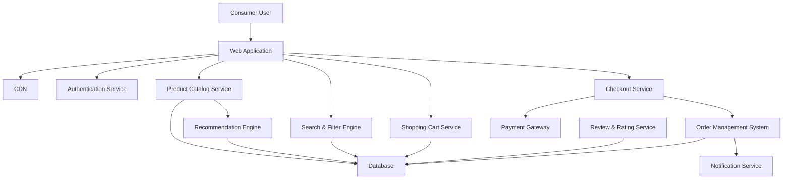

#### 1. High-Level Design

- **Summary**: This epic delivers the complete consumer shopping journey from product discovery through purchase completion. It includes user registration/authentication, product catalog with advanced search and filtering, shopping cart management, secure checkout with integrated payment gateway supporting multiple payment methods, order confirmation, product reviews/ratings, wishlist functionality, and personalized recommendations. The design prioritizes usability, security, and performance to maximize conversion rates.

- **Component Flow**:

- **Integration Points**:
  - Third-party payment gateway APIs for secure payment processing (credit cards, digital wallets, etc.)
  - Cloud hosting and CDN services for content delivery and performance optimization
  - Email notification providers for order confirmations and updates
  - User authentication service for secure buyer account management

- **Key Assumptions**:
  - Personalized recommendations will leverage collaborative filtering or content-based algorithms using historical purchase and browsing data
  - Product reviews will require verified purchase status to prevent fraudulent ratings

- **NFR Highlights**: Page load times ≤2 seconds for 95% of requests, checkout completion within 5 seconds, support for 100,000 concurrent users, encrypted data and transactions, PCI DSS compliance, WCAG 2.1 AA accessibility standards, 99.9% uptime SLA

- **Data Flow**: Consumers access the Web Application served via CDN for optimal performance. After authentication via Authentication Service, users browse the Product Catalog Service which queries the Database and leverages the Search & Filter Engine for keyword/category searches. Selected products are added to Shopping Cart Service (stored in Database). During checkout, Checkout Service coordinates with Payment Gateway for secure payment processing, then passes order details to Order Management System which persists orders in Database and triggers order confirmation via Notification Service. Recommendation Engine analyzes user behavior from Database to generate personalized product suggestions. Review & Rating Service captures user feedback and stores it in Database for display on product pages.

#### 2. Validation Report

- **Requirements Coverage**: The design fully addresses all scope requirements: user registration/authentication for buyers, product catalog with search and filter capabilities, product sorting and categorization, shopping cart functionality, secure checkout workflow, payment gateway integration with multiple methods, order confirmation and email notifications, product reviews and ratings, wishlist functionality, and personalized product recommendations. All NFRs are incorporated including performance targets (2-second page load, 5-second checkout), scalability (100,000 concurrent users), security (encryption, PCI DSS compliance), accessibility (WCAG 2.1 AA), and availability (99.9% uptime) through appropriate architectural patterns, CDN usage, and integration with compliant payment gateways.