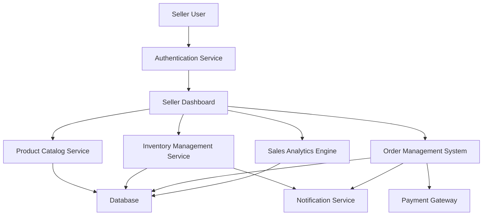

#### 1. High-Level Design

- **Summary**: This epic provides sellers with comprehensive tools to manage their business operations including product listing with images/descriptions, inventory management with automated low-stock alerts, order processing, and sales analytics through a dedicated seller dashboard. It enables sellers to efficiently manage their catalog, maintain accurate inventory levels, process orders, and track business performance metrics.

- **Component Flow**:

- **Integration Points**:
  - User authentication service for seller login and account verification
  - Payment gateway for seller payouts and transaction processing
  - Email/SMS notification providers for order updates and low inventory alerts
  - Product catalog service for listing synchronization
  - Order management system for order routing and fulfillment tracking

- **Key Assumptions**:
  - Product listings will support standard image formats (JPEG, PNG) with size limits defined by platform policy
  - Inventory updates will be near real-time with eventual consistency acceptable within 1-minute SLA

- **NFR Highlights**: 10,000 transactions per minute with horizontal scaling, product listing appears within 1 minute, real-time inventory updates, automated fraud detection for seller accounts, 99.9% uptime SLA

- **Data Flow**: Sellers authenticate via Authentication Service and access the Seller Dashboard. Product listing data (images, descriptions, pricing) flows through Product Catalog Service to the Database. Inventory Management Service tracks stock levels in the Database and triggers low-stock alerts via Notification Service when thresholds are breached. Order Management System receives new orders, updates order status in Database, and notifies sellers via Notification Service. Payment Gateway processes seller payouts based on completed orders. Sales Analytics Engine aggregates transaction data from Database and presents performance metrics on the dashboard.

#### 2. Validation Report

- **Requirements Coverage**: The design comprehensively covers all scope elements: seller registration/authentication, product listing with images/descriptions, inventory management and tracking, order management and processing, low inventory notifications, seller dashboard with sales analytics, order status updates, and seller account verification. All NFRs are addressed including 10,000 TPS capacity, 1-minute product listing SLA, real-time inventory updates, fraud detection, and 99.9% uptime through appropriate architectural components and scalability considerations.