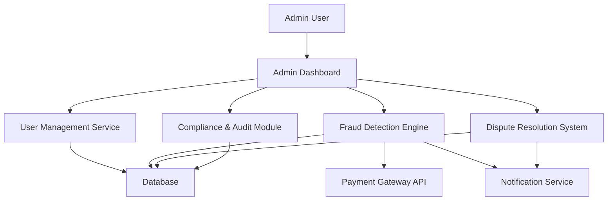

#### 1. High-Level Design

- **Summary**: This epic delivers a comprehensive administrative platform enabling platform administrators to monitor system health, manage users with role-based access control, resolve disputes, detect and prevent fraud, and ensure compliance with regulatory requirements (PCI DSS, data privacy laws). It provides an admin dashboard with analytics, user management tools, dispute resolution workflows, fraud detection mechanisms, and security controls including account lockout for suspicious activity.

- **Component Flow**:

- **Integration Points**: 
  - Cloud hosting and monitoring services for infrastructure
  - User authentication service for admin access control
  - Payment gateway APIs for transaction monitoring and fraud detection
  - Email/SMS notification providers for alerts and notifications
  - Compliance and security audit tools for regulatory reporting

- **Key Assumptions**: 
  - Fraud detection algorithms will leverage existing machine learning models or third-party services rather than custom development
  - Role-based access control will follow standard RBAC patterns with predefined admin roles (super admin, support admin, compliance officer)

- **NFR Highlights**: Real-time fraud detection, 99.9% uptime SLA, horizontal scaling to 100,000 concurrent users, 30-minute recovery from critical failures, PCI DSS and data privacy law compliance, encrypted user data

- **Data Flow**: Admin users access the dashboard to view platform analytics aggregated from the database. User management operations (create, update, delete, role assignment) flow through the User Management Service to the database. Fraud Detection Engine monitors transaction data from Payment Gateway API in real-time, flags suspicious activity, triggers account lockout, and sends alerts via Notification Service. Dispute resolution workflows capture case details, track resolution status in the database, and notify involved parties. Compliance Module aggregates audit logs and generates compliance reports from database records.

#### 2. Validation Report

- **Requirements Coverage**: The design fully addresses the epic's scope including admin dashboard, user management with RBAC, dispute resolution workflows, fraud detection mechanisms, account verification, security monitoring, compliance tracking, and suspicious activity detection. All stated NFRs (real-time fraud detection, automated failover, 30-minute recovery, encryption, PCI DSS compliance, horizontal scaling, 99.9% uptime) are incorporated into the architecture through appropriate components and integration points.