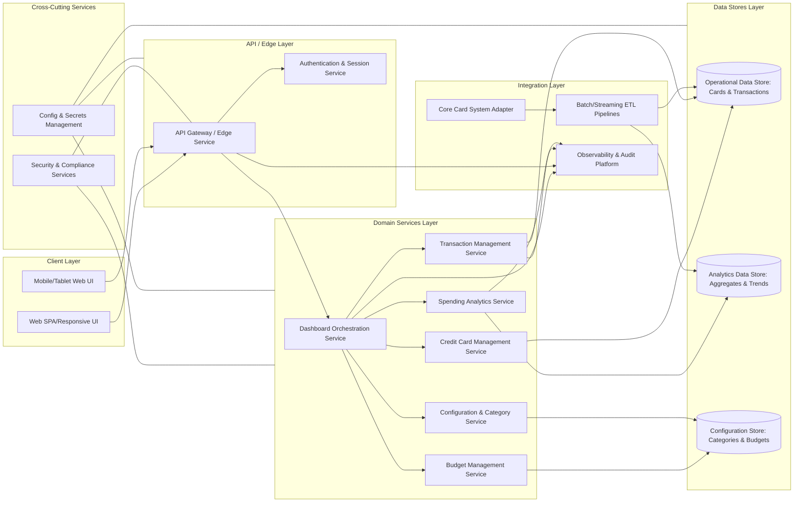

# High-Level Design (HLD) – QE-4105 Monthly Spending Summary Dashboard

## 1. Architecture Overview

The Monthly Spending Summary Dashboard is a multi-channel, enterprise-grade analytics and visualization solution that provides users with secure, responsive access to credit card spending data, transaction histories, utilization metrics, budgeting information, and financial insights.

The architecture is organized into the following layers:

- **Client Layer** – Web and mobile-responsive UI for dashboard views, filters/search, charts, and widgets.
- **API / Edge Layer** – Secure REST/GraphQL API gateway handling authentication, authorization, request validation, throttling, and routing.
- **Domain Services Layer** – Business services for card management, transaction management, analytics, and budgeting.
- **Data Stores Layer** – Operational data store for cards and transactions, analytics store for aggregated metrics, and configuration store for budgets and categories.
- **Integration Layer** – Connectors to upstream systems (e.g., core card systems) and downstream observability/audit platforms.
- **Cross-Cutting Concerns** – Security, compliance, resiliency, logging, monitoring, configuration, and secrets management.

### 1.1 High-Level Component Diagram

## 2. Component Descriptions

### 2.1 Client Layer

#### Web SPA / Responsive UI (WEB)
- Implements the primary dashboard interface accessible via modern browsers.
- Provides views for:
  - Monthly spending summary (total spend, credit limit, available credit, outstanding amount, utilization percentage, number of transactions).
  - Credit card management (multiple card tiles with masked card numbers, issuing bank, billing/due dates, credit limits, outstanding amounts).
  - Transaction management table (transaction date, merchant, category, card used, amount, payment status, remarks) with filters and search capabilities.
  - Spending analytics charts (category-wise, monthly trends, card-wise distribution, category breakdown).
  - Budget tracking (monthly budget, current spend, remaining budget, utilization%, progress bar).
  - Recent transactions widget (latest 5 transactions).
- Implements responsive layout and styling for desktop, tablet, and mobile using a responsive framework (e.g., CSS grid/flex, breakpoints).
- Performs client-side input validation for filter/search parameters (date ranges, amounts, category selections).

#### Mobile/Tablet Web UI (MBL)
- Shares core UI components with WEB but optimized for mobile and tablet screen sizes.
- Uses adaptive layouts (stacked views, collapsible filters) to maintain usability on smaller screens.
- Ensures touch-friendly controls (larger tappable areas, gestures for scrolling charts and tables).

### 2.2 API / Edge Layer

#### API Gateway / Edge Service (APIGW)
- Exposes secure endpoints for:
  - Dashboard summary retrieval.
  - Credit card list and details.
  - Transaction searches and filters.
  - Spending analytics and charts.
  - Budget data retrieval and update operations (if in scope for read/update).
  - Recent transactions.
- Performs:
  - Request authentication delegation to AUTHN.
  - Authorization checks using RBAC/ABAC policies.
  - Input validation (schema, types, ranges) and rate limiting.
  - Response formatting, pagination support for large transaction sets.
- Acts as the single entry point to internal domain services.

#### Authentication & Session Service (AUTHN)
- Handles user login and session/token management (e.g., OAuth2/OIDC, JWT).
- Validates tokens on each request from APIGW and attaches claims (user id, roles, permitted cards).
- Does not store or expose sensitive card details; only user identity and authorization context.

### 2.3 Domain Services Layer

#### Dashboard Orchestration Service (DASH)
- Aggregates data from CARD, TXN, ANL, and BUD to produce the dashboard summary response.
- Responsible for composing:
  - Total monthly spend, credit limit, available credit, outstanding amount, utilization percentage.
  - Number of transactions in the selected period.
  - Per-card summary tiles.
  - Widgets such as recent transactions and budget utilization.
- Implements business rules for:
  - How monthly windows are calculated (calendar month vs billing cycle, as per product rules).
  - Handling partially available data from upstream systems (e.g., missing transactions from some cards) with graceful degradation.

#### Credit Card Management Service (CARD)
- Manages card-level data used in the dashboard:
  - Card name, issuing bank, masked card number, credit limit, available credit, current outstanding, billing date, due date.
- Applies masking rules for card numbers at the service level (e.g., persist only tokenized or masked representation where appropriate).
- Fetches card information from ODS and, if needed, from CORE via Integration Layer.
- Applies business logic to compute per-card utilization.

#### Transaction Management Service (TXN)
- Provides transactional data for the dashboard:
  - Transaction date, merchant name, category, card used, amount, payment status, remarks.
- Supports filters and search capabilities:
  - Search by merchant.
  - Filter by category, bank, card, date range.
  - Sort by amount and date.
- Implements pagination and query optimization to handle large transaction volumes.
- Normalizes transaction records ingested from ETL/core systems into a unified schema.

#### Spending Analytics Service (ANL)
- Performs aggregation and analytics calculations used to render charts:
  - Category-wise spending summary.
  - Monthly spending trends.
  - Card-wise spending distribution.
  - Category breakdown across defined categories (food & dining, fuel, shopping, travel, entertainment, utilities, healthcare, education, miscellaneous).
- Uses ADS as the main data source with precomputed aggregates where appropriate for performance.
- Supports configurable time windows and filters aligned with UI selections.

#### Budget Management Service (BUD)
- Maintains budget configuration and runtime metrics for each user/card/category.
- Stores monthly budget definitions and calculates:
  - Current spend vs budget.
  - Remaining budget.
  - Budget utilization percentage.
- Provides data for a progress bar representation on the UI.
- Coordinates with ANL and TXN to ensure budget calculations consider relevant transactions.

#### Configuration & Category Service (CFG)
- Manages category taxonomy and related configuration:
  - Category names and attributes.
  - Mappings between merchant/category codes and dashboard categories.
- Stores UI and analytics configuration (e.g., which categories to show, color schemes for charts) in CFGDB.

### 2.4 Data Stores Layer

#### Operational Data Store (ODS)
- Stores normalized card and transaction records needed for operational queries.
- Data model includes:
  - Card table (id, masked card number/token, issuing bank, limits, outstanding amounts, billing/due dates, ownership/user references).
  - Transaction table (id, card id, transaction date, merchant, category id, amount, payment status, remarks, posting date, source system reference).
- Designed for high read throughput (indexes on date, card, category, merchant).

#### Analytics Data Store (ADS)
- Stores aggregated metrics for analytics queries.
- Data model includes:
  - Fact tables for spending by category, card, month.
  - Materialized views for monthly spending trend and card-wise distribution.
- Optimized for analytical workloads (e.g., columnar storage, OLAP indexes).

#### Configuration Store (CFGDB)
- Stores categories, budget configurations, and dashboard settings.
- Schema includes:
  - Category definitions.
  - Per-user/per-card budget rules and thresholds.
  - Feature toggles and chart display configurations.

### 2.5 Integration Layer

#### Core Card System Adapter (CORE)
- Encapsulates integration with upstream card systems and/or transaction feeds.
- Responsible for:
  - Fetching or receiving card master data and transaction feeds.
  - Mapping external data formats to ODS schemas.
- Uses secure channels and avoids storing sensitive data beyond what is required and permitted.

#### Batch/Streaming ETL Pipelines (ETL)
- Implement data ingestion from external systems into ODS and ADS.
- Pipelines:
  - Periodic batch jobs to reconcile card and transaction data.
  - Streaming ingestion for near real-time updates where required.
- Ensure idempotent processing and support backfill scenarios.

#### Observability & Audit Platform (OBS)
- Central destination for logs, metrics, traces, and audit records.
- Receives event streams from APIGW, DASH, TXN, ANL, and other services.

### 2.6 Cross-Cutting Services

#### Security & Compliance Services (SEC)
- Provide services and libraries for:
  - Transport security configuration.
  - Data encryption at rest and in transit.
  - Authorization and policy enforcement.
  - Audit logging and tamper-evident storage.

#### Config & Secrets Management (CCH)
- Centralized configuration service (e.g., config server, parameter store).
- Secrets management (e.g., vault) for credentials, API keys, encryption keys.

## 3. Integration Points & Data Flow

### 3.1 Authentication & Session Flow

1. User accesses WEB/MBL and initiates login.
2. Client redirects user to AUTHN (or integrated IdP) for authentication.
3. Upon successful login, AUTHN issues an access token containing user identity and authorization claims.
4. Client stores the token securely (e.g., HTTP-only cookie or secure storage) and includes it in subsequent requests to APIGW.
5. APIGW validates the token via AUTHN, extracts claims, and continues processing only if valid.

**Scope Coverage:** Enables secure user access, prerequisite for all dashboard operations; applies across dashboard, card management, transaction management, analytics, budgeting, and recent transactions.

### 3.2 Dashboard Summary Request Flow

1. Client calls `GET /dashboard/summary` on APIGW with optional query parameters (e.g., month, date range).
2. APIGW validates input (date range, formats) and enforces authorization policies.
3. APIGW invokes DASH with user context and query parameters.
4. DASH queries CARD for card list and per-card financials (limits, available credit, outstanding amounts).
5. DASH queries TXN/ANL to compute total monthly spend and number of transactions.
6. DASH calculates utilization percentage (e.g., total outstanding vs total credit limit) and composes the summary.
7. DASH returns a unified summary model to APIGW.
8. APIGW formats the response and returns it to the client.

**Scope Coverage:** Dashboard Summary, total monthly spend, total credit limit, available credit, outstanding amount, utilization percentage, number of transactions.

### 3.3 Credit Card Management Data Flow

1. Client calls `GET /cards` on APIGW.
2. APIGW validates request and checks user authorization.
3. APIGW invokes CARD with user identity.
4. CARD retrieves card records from ODS for the user.
5. CARD applies masking rules to card numbers and calculates credit utilization per card.
6. CARD returns card details (card name, issuing bank, masked card number, credit limit, available credit, current outstanding, billing date, due date).
7. APIGW passes the sanitized data back to the client.

**Scope Coverage:** Credit card management and display of multiple cards and attributes.

### 3.4 Transaction Management & Filtering Flow

1. Client calls `GET /transactions` with filters (merchant, category, bank, card, date range) and sorting options (amount, date).
2. APIGW validates filter input (types, allowed ranges) and normalizes them.
3. APIGW invokes TXN with user context and query criteria.
4. TXN constructs optimized queries against ODS using indexes for date, merchant, category, and card.
5. ODS returns a paged result set of transactions.
6. TXN enriches records with category and card display names using CFG.
7. TXN returns the enriched, paginated results to APIGW.
8. APIGW returns data to the client for display in the responsive transaction table.

**Scope Coverage:** Transaction management, table display, filters (merchant, category, bank, card, date range), search, sort by amount/date.

### 3.5 Spending Analytics & Chart Flow

1. Client calls analytics endpoints (e.g., `GET /analytics/category`, `GET /analytics/monthlyTrend`, `GET /analytics/cardDistribution`).
2. APIGW validates query parameters (time window, card filters) and authorizes access.
3. APIGW invokes ANL with normalized criteria.
4. ANL queries ADS for precomputed aggregates or computes on demand when needed.
5. ANL maps results to a format suitable for chart rendering (labels, series, values) and ensures categories match CFG definitions.
6. ANL returns the analytics data to APIGW.
7. APIGW returns chart-ready payloads to the client.

**Scope Coverage:** Spending analytics charts including category-wise spending, monthly trend, card-wise distribution, category breakdown with defined categories.

### 3.6 Budget Tracking Flow

1. Client calls `GET /budget/summary` for a given month or period.
2. APIGW validates inputs and authorizes the request.
3. APIGW invokes BUD with user context and selected period.
4. BUD retrieves budget definitions from CFGDB (e.g., per-user/per-card/monthly budget).
5. BUD queries TXN/ANL to compute current spend during the selected period.
6. BUD calculates remaining budget and utilization percentage.
7. BUD prepares a summary including values required for the progress bar.
8. APIGW returns the budget summary to the client.

**Scope Coverage:** Budget tracking (monthly budget, current spend, remaining budget, budget utilization %, progress bar).

### 3.7 Recent Transactions Widget Flow

1. Client calls `GET /transactions/recent?limit=5`.
2. APIGW validates the limit and checks authorization.
3. APIGW invokes TXN with user context and a query restricted to the most recent transactions.
4. TXN queries ODS using sorting by transaction/posting date and applies the limit.
5. TXN returns the latest 5 transactions, enriched with merchant, category, and card identifiers.
6. APIGW returns the result to the client for widget rendering.

**Scope Coverage:** Recent transactions widget showing latest 5 transactions.

### 3.8 Data Ingestion & Synchronization Flow

1. External systems send card and transaction data to CORE using secure integration channels.
2. CORE transforms the data to internal canonical models.
3. ETL pipelines ingest data from CORE into ODS (card and transaction tables).
4. ETL processes update ADS with aggregated metrics (e.g., category spending, monthly trends) either in batch or streaming mode.
5. Dashboard and analytics services use updated ODS/ADS data in subsequent user requests.

**Scope Coverage:** Ensures underlying data availability for all dashboard, transaction, analytics, and budget flows.

### 3.9 Observability & Audit Flow

1. APIGW emits access logs and security events (e.g., authentication failures, authorization denials) to OBS.
2. Domain services (DASH, CARD, TXN, ANL, BUD) emit service logs, metrics (latency, error rates), and business events (e.g., filter usage patterns).
3. Audit events (e.g., budget changes, configuration changes) are captured and transmitted to OBS.
4. OBS stores and surfaces dashboards/alerts for operators.

**Scope Coverage:** Observability and audit for all user and system flows.

## 4. Security & Compliance Features

Security and compliance are applied consistently across the architecture. The dashboard deals with financial data about card usage and transactions, but no actual card numbers (beyond masked) or payment authorization flows are designed here.

### 4.1 Transport Security
- All client-to-APIGW traffic enforced over TLS (HTTPS), using modern cipher suites.
- Internal service-to-service communication secured using mTLS where feasible.
- Strict TLS configuration managed centrally by SEC and CCH.

### 4.2 Data Encryption
- Encryption at rest applied to ODS, ADS, and CFGDB using platform-native or dedicated encryption solutions.
- Application-level encryption applied to sensitive fields where required (e.g., card identifiers, user identifiers) before persistence.
- Keys managed via CCH (secrets vault) with strict access controls and rotation policies.

### 4.3 Input Validation & Output Filtering
- APIGW performs schema validation against incoming payloads, including filters and search parameters.
- Server-side validation ensures date ranges, amounts, and category values are within acceptable bounds.
- Output filtering ensures only masked card numbers and permitted fields are returned; raw identifiers or sensitive backend references are excluded from API responses.

### 4.4 RBAC/ABAC
- AUTHN issues tokens with roles and attributes describing user permissions and allowed card sets.
- APIGW enforces RBAC/ABAC policies:
  - Users can only access cards and transactions associated with their identity.
  - Administrative operations (e.g., category or budget configuration) restricted to appropriate roles.
- Policy definitions stored centrally and applied consistently across services.

### 4.5 Audit Logging
- Access logs for all API calls persisted with non-sensitive identifiers (e.g., user id, card id, transaction id, endpoint, result codes).
- Business audit logs recorded for operations affecting configuration or budgets.
- Audit stores are tamper-evident and support retention requirements.

### 4.6 Secrets Management
- All external integration credentials (e.g., CORE system connection, database passwords, TLS certificates) stored in a secrets vault.
- No secrets in source code or configuration files; services retrieve them at startup via CCH.
- Regular rotation and revocation processes implemented.

### 4.7 Compliance Mapping
- Financial transaction and card usage data suggest alignment with **PCI-DSS principles**, but payment authorization and full card numbers are not handled.
  - Card numbers are stored and displayed only in masked form.
  - Access to card data is controlled by strong authentication and authorization.
  - Logging avoids storing full PAN or sensitive authentication data.
- Data protection aligns with **privacy regulations** (e.g., GDPR/CCPA-style principles) by:
  - Minimizing personally identifiable information in logs.
  - Providing mechanisms to restrict data access by role.

## 5. Resiliency & Error Handling

### 5.1 Retry Mechanisms
- Client retries limited to idempotent GET requests and governed by backoff strategies.
- APIGW and domain services may retry calls to downstream dependencies (e.g., ETL status, CORE adapters) using exponential backoff.

### 5.2 Circuit Breakers
- Circuit breakers configured for external integrations (CORE, ETL pipelines) and heavy dependencies.
- When a downstream system becomes unstable, circuit breakers open to prevent cascading failures and return fallback responses where appropriate (e.g., partial analytics data).

### 5.3 Timeouts
- Strict timeouts for all external calls from APIGW and domain services.
- Analytics queries and large transaction queries tuned with query timeouts and pagination to prevent resource exhaustion.

### 5.4 Graceful Degradation
- If analytics store (ADS) is unavailable, DASH can still provide core card and transaction information from ODS, while charts may be temporarily limited.
- Recent transactions widget and basic transaction views can operate without full analytics.
- UI clearly indicates partial data availability instead of failing silently.

### 5.5 Error Handling & Exposure
- Error responses include standardized status codes:
  - `400 Bad Request` for validation errors (e.g., invalid filters, malformed date ranges).
  - `401 Unauthorized` for unauthenticated requests.
  - `403 Forbidden` for unauthorized operations.
  - `404 Not Found` for missing resources.
  - `429 Too Many Requests` for rate-limited clients.
  - `500 Internal Server Error` for unexpected failures.
- Error payloads contain non-sensitive, user-friendly messages and correlation IDs; internal stack traces are not exposed.

### 5.6 Observability
- Metrics collected:
  - Request latency and throughput per endpoint.
  - Error rates and circuit breaker states.
  - ETL pipeline health and lag.
- Distributed tracing across APIGW, DASH, CARD, TXN, ANL, BUD to trace end-to-end flows.
- Alerts configured for SLA breaches (e.g., dashboard latency, ETL lag).

## 6. Validation Report

### 6.1 Requirements Coverage

Each **Scope (High Level)** item is mapped to components and flows.

1. **Dashboard Summary (Total Monthly Spend, Total Credit Limit, Available Credit, Outstanding Amount, Utilization Percentage, Number of Transactions)**
   - Components: DASH, CARD, TXN, ANL, APIGW, WEB/MBL.
   - Flows: 3.2 Dashboard Summary Request Flow; 3.8 Data Ingestion & Synchronization Flow.

2. **Credit Card Management – Display Multiple Cards (Card Name, Issuing Bank, Masked Card Number, Credit Limit, Available Credit, Current Outstanding, Billing Date, Due Date)**
   - Components: CARD, ODS, APIGW, WEB/MBL.
   - Flows: 3.3 Credit Card Management Data Flow.

3. **Transaction Management – Responsive Table (Transaction Date, Merchant Name, Category, Card Used, Amount, Payment Status, Remarks)**
   - Components: TXN, ODS, CFG, APIGW, WEB/MBL.
   - Flows: 3.4 Transaction Management & Filtering Flow; 3.8 Data Ingestion & Synchronization Flow.

4. **Filters and Search (Search by Merchant, Filter by Category, Bank, Card, Date Range; Sort by Amount, Date)**
   - Components: TXN, ODS, APIGW, WEB/MBL.
   - Flows: 3.4 Transaction Management & Filtering Flow.

5. **Spending Analytics – Charts (Category-wise Spending, Monthly Spending Trend, Card-wise Spending Distribution, Category Breakdown)**
   - Components: ANL, ADS, CFG, APIGW, WEB/MBL.
   - Flows: 3.5 Spending Analytics & Chart Flow; 3.8 Data Ingestion & Synchronization Flow.

6. **Category Breakdown – Categories (Food & Dining, Fuel, Shopping, Travel, Entertainment, Utilities, Healthcare, Education, Miscellaneous)**
   - Components: CFG, ANL, ADS, APIGW, WEB/MBL.
   - Flows: 3.5 Spending Analytics & Chart Flow.

7. **Budget Tracking (Monthly Budget, Current Spend, Remaining Budget, Budget Utilization %, Progress Bar)**
   - Components: BUD, CFGDB, TXN, ANL, APIGW, WEB/MBL.
   - Flows: 3.6 Budget Tracking Flow; 3.8 Data Ingestion & Synchronization Flow.

8. **Recent Transactions Widget – Latest 5 Transactions**
   - Components: TXN, ODS, APIGW, WEB/MBL.
   - Flows: 3.7 Recent Transactions Widget Flow.

9. **Responsive Design – Mobile, Tablet, Desktop Friendly**
   - Components: WEB, MBL.
   - Flows: Primarily client-side behavior; relies on all server-side flows (3.1–3.8) but manifests via UI adaptations.

### 6.2 Compliance Status

- **Transport Security**: **Pass**
  - TLS enforced for all external traffic; mTLS for internal where feasible.

- **Data Encryption (At Rest & In Transit)**: **Pass-with-conditions**
  - Design includes encryption at rest and in transit, with key management via CCH.
  - Implementation must ensure encryption coverage for all sensitive fields and compliance with organizational policies.

- **Input Validation & Output Filtering**: **Pass**
  - APIGW and domain services perform robust validation and limit outputs to masked card numbers and necessary fields.

- **RBAC/ABAC**: **Pass-with-conditions**
  - Role and attribute-based policies defined; must be implemented consistently across APIGW and domain services, including admin operations for configuration and budgets.

- **Audit Logging**: **Pass**
  - Centralized audit logging design; retention and tamper-evidence mechanisms present.

- **Secrets Management**: **Pass**
  - All secrets managed via CCH (vault), with rotation and no secrets in code.

- **PCI-DSS Alignment**: **Pass-with-conditions**
  - PAN exposed only in masked form; strong controls around access, logging, and encryption.
  - Full PCI-DSS compliance depends on organizational scope, upstream integrations, and formal assessments.

- **Privacy / Data Protection (e.g., GDPR-style)**: **Pass-with-conditions**
  - Design minimizes PII exposure and logs; actual compliance depends on data classification, retention settings, and user rights management in implementation.

### 6.3 Identified Ambiguities/Risks

1. **Ambiguity: Definition of “Monthly” Window**
   - **Risk**: Inconsistent calculations of monthly spending and budget utilization across users or cards (calendar month vs billing cycle), leading to confusion and inaccurate analytics.
   - **Consequence**: Misleading dashboard summaries and budget tracking; potential user dissatisfaction and support load.
   - **Mitigation**: Define a clear, configurable rule for “month” per user/card (e.g., calendar vs statement cycle) stored in CFGDB; ensure DASH, ANL, and BUD use this consistently.

2. **Ambiguity: Source of Card and Transaction Data**
   - **Risk**: Different upstream systems may supply overlapping or partial data, causing duplicates or gaps in ODS/ADS.
   - **Consequence**: Inaccurate totals (monthly spend, utilization) and analytics.
   - **Mitigation**: Implement canonical data ownership rules and deduplication logic in ETL; define SLAs for data freshness and reconciliation processes.

3. **Ambiguity: Budget Creation & Modification Workflow**
   - **Risk**: Unclear whether users can set/modify budgets via the dashboard or whether budgets are defined externally.
   - **Consequence**: BUD may expose write operations without proper authorization and audit; risk of unauthorized changes.
   - **Mitigation**: Clarify scope for budget CRUD operations; if user-editable, design secure APIs with RBAC, validation, and audit; otherwise, treat budgets as read-only from external systems.

4. **Ambiguity: Handling of Merchant and Category Taxonomy Changes**
   - **Risk**: Changes in category definitions or merchant mapping may affect historical analytics and consistency of chart displays.
   - **Consequence**: Confusing analytics trends and misaligned category breakdowns.
   - **Mitigation**: Version category taxonomies in CFGDB; ANL should support mapping historical data to appropriate versions or provide migration routines.

5. **Ambiguity: Performance & Volume Assumptions**
   - **Risk**: Transaction volumes and number of cards per user are unspecified; naive implementations may struggle at enterprise scale.
   - **Consequence**: Slow dashboard load, timeouts in transaction searches and analytics queries.
   - **Mitigation**: Establish volume targets and performance SLAs; use indexing strategies, caching (for summary and analytics), and pagination; consider asynchronous precomputation of heavy analytics.

6. **Boundary Risk: Out-of-Scope Operational Processes**
   - **Risk**: Processes such as dispute handling, payment processing, card issuance, and full PCI workflows are not covered but may be expected by some stakeholders.
   - **Consequence**: Misaligned expectations; potential attempts to extend dashboard design into areas without proper security/compliance design.
   - **Mitigation**: Explicitly document that the dashboard is an informational/analytics interface only; integration points to external systems for payments or disputes must be addressed in future epics with dedicated compliance design.

7. **Ambiguity: Multi-Region/Multi-Tenancy Requirements**
   - **Risk**: Global deployments, multi-tenant architectures, or region-specific compliance may be needed but are not specified.
   - **Consequence**: Future rework of data partitioning and access controls.
   - **Mitigation**: Design data models and services with tenant/region identifiers in mind; document multi-tenancy/multi-region as potential extensions to be refined later.

## 7. Out-of-Scope Acknowledgement

Although the Epic focuses on dashboard, transaction visibility, analytics, and budgeting, certain areas are intentionally **not** addressed by this HLD:

- Payment processing, authorization, settlement flows.
- Card issuance, lifecycle management, and dispute resolution workflows.
- User profile management beyond what is needed for authentication and authorization.
- Data science models for advanced recommendations or predictive analytics.

These are recognized boundaries; if later epics introduce these capabilities, they must be designed with dedicated security, compliance, and integration considerations.
