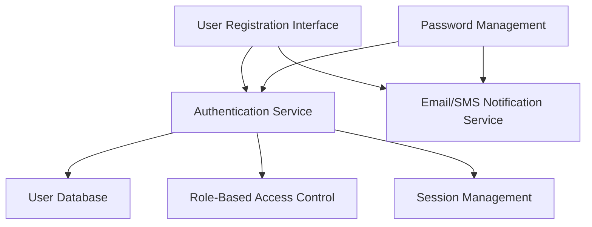

#### 1. High-Level Design

- **Summary**: This epic establishes the foundational user lifecycle management system supporting three distinct user roles (consumers, sellers, administrators) with secure registration, authentication, role-based access control, password management, session management, and account verification. The system ensures data encryption, compliance with security standards, and provides the authorization foundation for all platform features.

- **Component Flow**:

- **Integration Points**: 
  - Email/SMS notification providers for confirmation emails and password resets
  - Cloud hosting services for user data storage
  - Third-party authentication services if implemented

- **Key Assumptions**: 
  - Role assignment occurs during registration based on user type selection (consumer/seller/admin)
  - Session tokens use industry-standard JWT or similar mechanism with configurable expiration

- **NFR Highlights**: All user data encrypted in transit and at rest; PCI DSS compliance; account lockout for suspicious activity; 100,000 concurrent users; WCAG 2.1 AA accessibility; 99.9% uptime

#### 2. Validation Report

- **Requirements Coverage**: The design fully addresses all scope requirements including user registration for multiple roles, authentication/login, role-based access control, password management and recovery, session management, profile management, account verification, and email confirmation workflows. The architecture clearly separates authentication, authorization (RBAC), and session management concerns, enabling secure and scalable user management. All specified NFRs (encryption, PCI DSS compliance, account lockout, concurrent user support, accessibility, uptime) are architecturally supported through dedicated security services, cloud infrastructure, and session management mechanisms.