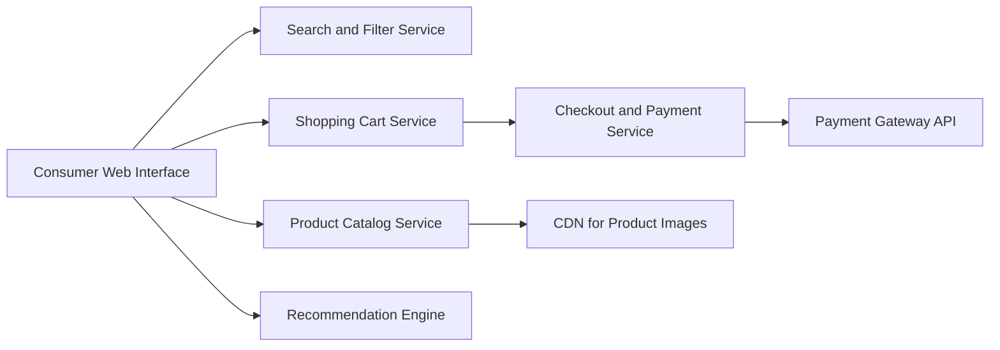

#### 1. High-Level Design

- **Summary**: This epic delivers an end-to-end product discovery and purchase experience for consumers, including advanced search and filtering, product catalog browsing, shopping cart management, secure checkout with multiple payment methods, product reviews/ratings, wishlist functionality, and personalized recommendations. The system emphasizes performance (2-second page loads) and accessibility while integrating with payment gateways and CDN services.

- **Component Flow**:

- **Integration Points**: 
  - Third-party payment gateway APIs for credit card and PayPal processing
  - Cloud hosting and CDN services for product images and content delivery
  - Email notification providers for order confirmations
  - Search engine or indexing service for product discovery

- **Key Assumptions**: 
  - Product data schema includes standard attributes (SKU, price, images, descriptions) compatible with search indexing
  - Recommendation engine uses collaborative filtering or similar algorithm based on user behavior data

- **NFR Highlights**: Page load times ≤2 seconds for 95% of requests; checkout completion within 5 seconds; PCI DSS compliance; 10,000 transactions/minute; 100,000 concurrent users with horizontal scaling; WCAG 2.1 AA accessibility

#### 2. Validation Report

- **Requirements Coverage**: The design comprehensively addresses all scope elements including product catalog, search/filter, shopping cart, secure checkout, payment integration, product reviews, wishlist, and recommendations. The component architecture separates concerns effectively with dedicated services for search, catalog, cart, and checkout, enabling independent scaling and maintenance. All NFRs are architecturally supported through CDN for performance, payment gateway integration for PCI DSS compliance, horizontal scaling for concurrency, and accessibility standards implementation in the web interface.