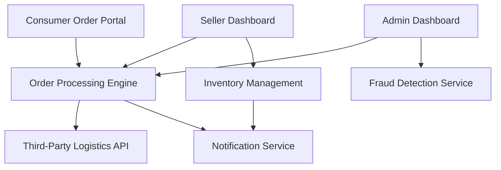

#### 1. High-Level Design

- **Summary**: This epic delivers a comprehensive order lifecycle management system supporting three user roles (sellers, consumers, administrators). It enables sellers to manage products and inventory, consumers to track and manage orders, and administrators to oversee platform operations, fraud detection, and dispute resolution. The system integrates with third-party logistics for shipping updates and provides real-time notifications across the order lifecycle.

- **Component Flow**:

- **Integration Points**: 
  - Third-party logistics APIs for automatic shipping updates and tracking
  - Email/SMS notification providers for order and inventory alerts
  - Cloud hosting services for analytics and data storage
  - Payment gateway APIs for refund processing
  - Fraud detection services or algorithms

- **Key Assumptions**: 
  - Order data format will follow standard e-commerce schemas (JSON/XML) for logistics API integration
  - Seller onboarding and verification process is handled separately or exists as prerequisite

- **NFR Highlights**: Real-time order updates with minimal latency; 10,000 transactions/minute; 99.9% uptime; 30-minute recovery from critical failures; horizontal scaling to 100,000 concurrent users; continuous fraud detection

#### 2. Validation Report

- **Requirements Coverage**: The design covers all stated scope elements including seller dashboard, inventory management, order processing, consumer order tracking, admin capabilities, dispute resolution, fraud detection, and third-party logistics integration. The component flow demonstrates clear separation of concerns across the three user roles while maintaining integration points for notifications and external services. All specified NFRs (real-time updates, transaction volume, uptime, scaling, fraud detection) are architecturally supported through dedicated services and cloud infrastructure.