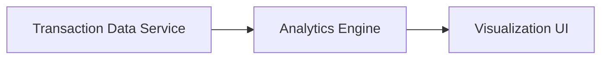

#### 1. High-Level Design
- Summary: This epic introduces interactive analytics to help users understand their spending habits. It includes interactive visualizations for spending trends over time, breakdowns by defined categories (e.g., Food & Dining, Shopping), and analysis of spending per card.
- Component Flow:

- Integration Points: Upstream: Transaction Data Service; Downstream: Visualization UI.
- Key Assumptions: Transaction data is provided in a structured format (e.g., JSON) on a daily basis. The user interface is a web-based dashboard.
- NFR Highlights: Visualizations must be interactive and render efficiently with typical transaction volumes.
- Data Flow: Categorized transaction data is ingested from the upstream service. The analytics engine processes this data to calculate spending trends and breakdowns. The resulting aggregated data is sent to the UI for rendering as interactive charts.
#### 2. Validation Report
- Requirements Coverage: The design covers the core requirements for visualizing spending analysis by category, trend, and card as stated in the epic's scope.
