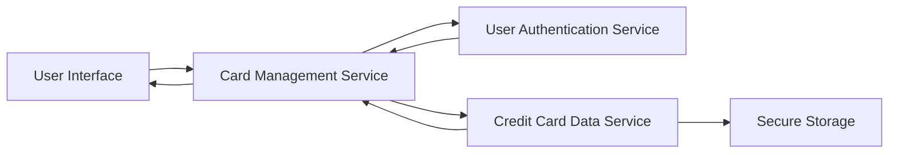

#### 1. High-Level Design

- **Summary:** This epic enables users to manage and view multiple credit cards within a unified interface, supporting operations to add, view, and switch between cards while accessing card-specific details such as card number, issuer, credit limit, and current balance. The feature centralizes card management for up to 10 cards per user.

- **Component Flow:**

- **Integration Points:** 
  - **Upstream:** User Authentication Service (provides user identity verification)
  - **Downstream:** Credit Card Data Service (provides card details and management operations)
  - **Data Flow:** Card Management Service authenticates users via User Authentication Service and retrieves/manages card data through Credit Card Data Service

- **Key Assumptions:** 
  - Card switching is client-side operation with pre-loaded card metadata for instantaneous response
  - Card data encryption is handled at the Credit Card Data Service and Secure Storage layer

- **NFR Highlights:** System must support at least 10 credit cards per user; card switching must be instantaneous with no lag; data must be securely stored and encrypted

#### 2. Validation Report

- **Requirements Coverage:** The design addresses all scope items including multiple credit card display, card details view, card switching functionality, card information management, and card-wise spend analysis. The component flow shows clear separation between authentication, card management orchestration, and data storage layers.

- **Traceability:** All functional requirements map to the Card Management Service which coordinates with User Authentication Service for security and Credit Card Data Service for data operations.

- **Gaps/Risks:** 
  - "Add card" functionality scope is unclear (manual entry vs. integration with external systems)
  - Card number masking/PCI compliance requirements not explicitly stated
  - Instantaneous card switching may require client-side caching strategy not detailed in epic

- **Compliance Notes:** Data encryption requirement addresses PCI-DSS compliance; secure storage requirement implies encryption at rest; user authentication integration addresses access control requirements