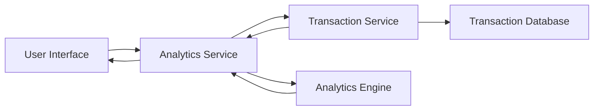

#### 1. High-Level Design

- **Summary:** This epic provides interactive visualizations and analytics for users to understand spending patterns across nine predefined categories (Food & Dining, Fuel, Shopping, Travel, Entertainment, Utilities, Healthcare, Education, Miscellaneous) and time periods. Users can view monthly spend trends, analyze category-wise spending, and gain insights through visual charts and graphs with filtering capabilities.

- **Component Flow:**

- **Integration Points:** 
  - **Downstream:** Transaction Service (provides transaction data)
  - **Downstream:** Analytics Engine (performs data processing and visualization preparation)
  - **Data Flow:** Analytics Service retrieves transaction data from Transaction Service and leverages Analytics Engine for aggregation, categorization, and trend analysis

- **Key Assumptions:** 
  - Transaction categorization is automated by the Analytics Engine using predefined rules or machine learning
  - Historical transaction data is pre-aggregated for performance to meet 3-second rendering requirement

- **NFR Highlights:** Analytics visualizations must render within 3 seconds; system must support filtering by date range and category; charts must be interactive and responsive across all devices

#### 2. Validation Report

- **Requirements Coverage:** The design covers all scope elements including monthly spend trends visualization, category-wise spending analysis, interactive charts and graphs, spending pattern identification, transaction categorization, and card-wise spend breakdown. The component flow demonstrates clear separation between data retrieval, analytics processing, and presentation layers.

- **Traceability:** All functional requirements are addressed through the Analytics Service which orchestrates data flow from Transaction Service and processing through Analytics Engine to deliver visualizations to the user interface.

- **Gaps/Risks:** 
  - Transaction categorization logic and accuracy mechanism not specified
  - Data aggregation strategy for 3-second rendering requirement needs definition
  - Interactive chart library/technology not specified (impacts responsive design implementation)

- **Compliance Notes:** Responsive design requirement addresses accessibility standards; filtering capabilities support user control over data visibility; 3-second rendering requirement addresses performance standards