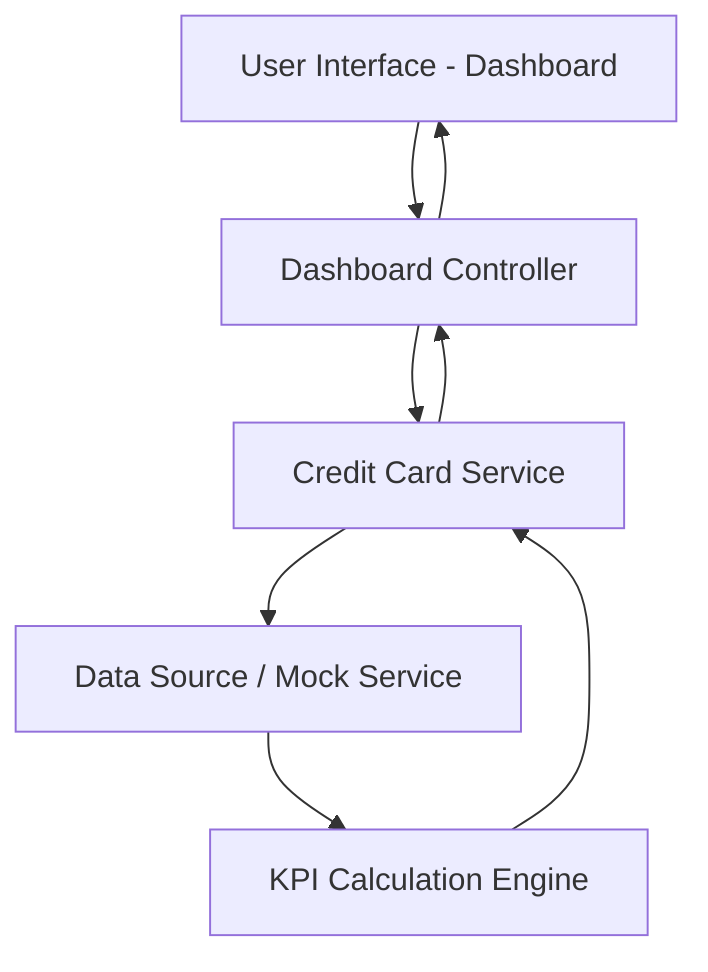

#### 1. High-Level Design

- **Summary**: This epic delivers a consolidated dashboard that displays key performance indicators (KPIs) for users' credit card portfolios, including monthly spend, total credit limit, available credit, and outstanding amount. The solution provides a multi-card view interface enabling users to monitor their overall credit card financial health from a single responsive dashboard.

- **Component Flow**:

- **Integration Points**: 
  - Credit card data source or mock data service (upstream) - provides raw credit card data including balances, limits, and transaction information
  - No downstream systems explicitly mentioned in the epic

- **Key Assumptions**: 
  - KPI calculations (monthly spend, available credit) are performed server-side or in a dedicated calculation layer; data refresh frequency is assumed to be near real-time or on-demand user refresh
  - Mock data service will simulate realistic credit card data structures with multiple cards per user

- **NFR Highlights**: Dashboard must be responsive across desktop, tablet, and mobile devices; KPI data must refresh and display within acceptable latency for real-time financial monitoring

- **Data Flow**: User accesses the dashboard → Dashboard controller requests credit card data from the Credit Card Service → Service retrieves data from the data source/mock service → KPI Calculation Engine computes monthly spend, available credit, and outstanding amounts → Calculated KPIs are returned to the controller → Dashboard UI renders the consolidated view with all KPIs and multi-card information in a responsive layout

#### 2. Validation Report

- **Requirements Coverage**: The design covers all stated scope items including Dashboard KPIs display (Monthly Spend, Total Credit Limit, Available Credit, Outstanding Amount), multiple credit card view, consolidated interface, and responsive layout. The component architecture supports the NFR requirements for responsiveness and acceptable latency. The design explicitly addresses the dependency on credit card data source/mock service and excludes all out-of-scope items (real bank integration, payments, transfers, loans).