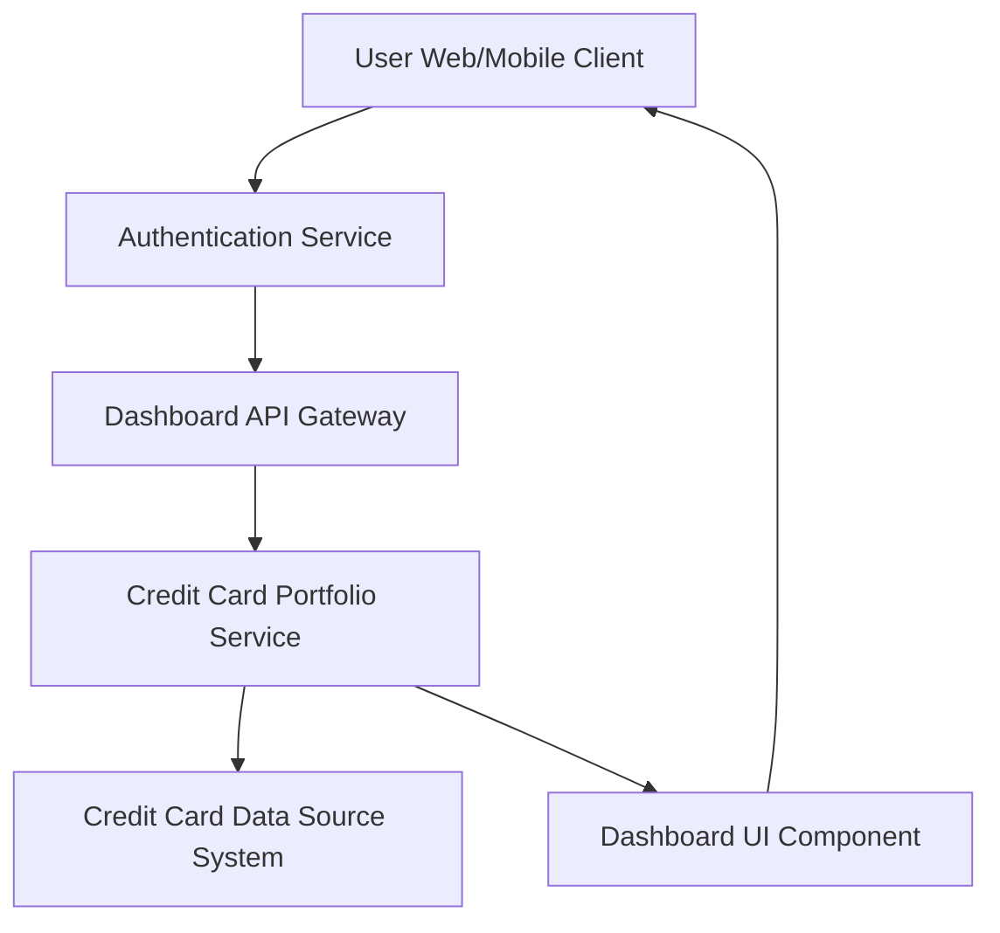

#### 1. High-Level Design

- **Summary**: This epic delivers a consolidated dashboard that provides users with centralized visibility into their entire credit card portfolio. The dashboard displays key performance indicators including monthly spend, total credit limit, available credit, and outstanding amounts across multiple credit cards, enabling users to monitor their overall credit card portfolio health and financial position from a single interface.

- **Component Flow**:

- **Integration Points**: 
  - **Upstream**: Credit card data source system (provides card details, balances, limits, and transaction summaries)
  - **Upstream**: User authentication service (validates user identity and authorizes access to card data)
  - **Downstream**: Dashboard UI component (renders responsive interface for web and mobile)

- **Key Assumptions**: 
  - Credit card data is refreshed periodically from the data source system; real-time updates are not required for KPI calculations.
  - Available credit is calculated as (Total Credit Limit - Outstanding Amount) within the service layer.

- **NFR Highlights**: Dashboard must load within 2 seconds; support responsive design for mobile and desktop; handle multiple credit cards without performance degradation.

- **Data Flow**: User authenticates → Authentication service validates credentials → Dashboard API Gateway routes request to Credit Card Portfolio Service → Service fetches card data (limits, balances, outstanding amounts) from Credit Card Data Source System → Service aggregates data across all user cards to calculate KPIs (monthly spend, total credit limit, available credit, outstanding amounts) → Processed data is sent to Dashboard UI Component → UI renders responsive dashboard with KPIs → User views consolidated portfolio health on their device.

#### 2. Validation Report

- **Requirements Coverage**: The design fully covers the epic's stated scope including dashboard interface, monthly spend tracking, total credit limit display, available credit calculation, outstanding amount tracking, multiple credit card view, and responsive layout design. All six core functional requirements are addressed through the Credit Card Portfolio Service and Dashboard UI Component. The architecture supports the NFRs by separating concerns (authentication, data retrieval, aggregation, presentation) to enable performance optimization and responsive rendering across devices.