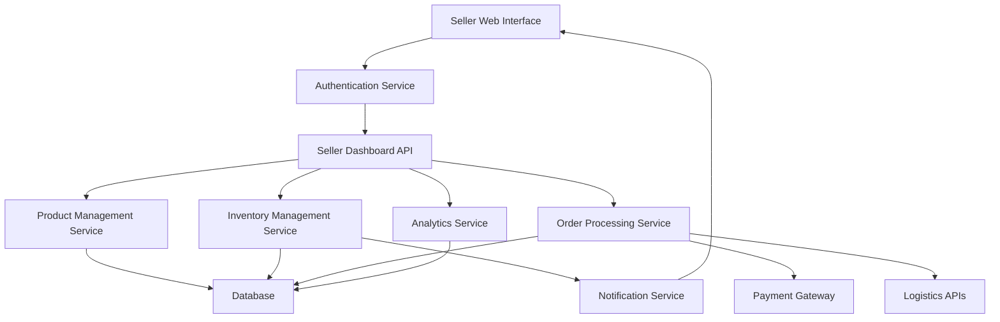

#### 1. High-Level Design

- **Summary**: This epic delivers a comprehensive seller management platform enabling sellers to register, list products, manage inventory, process orders, and track sales performance. The system provides a seller dashboard with product management capabilities, inventory tracking with automated alerts, order fulfillment workflows, and sales analytics, targeting 25% growth in seller onboarding within the first year.

- **Component Flow**:

- **Integration Points**: 
  - **Upstream**: Cloud hosting and CDN services for platform infrastructure
  - **Downstream**: Email/SMS notification providers for inventory alerts and order notifications, payment gateway APIs for seller payment processing, third-party logistics APIs for shipping coordination

- **Key Assumptions**: 
  - Product listing data format follows standard e-commerce schema (SKU, title, description, price, images)
  - Inventory updates are event-driven with configurable low-stock threshold per product

- **NFR Highlights**: Product listing must appear in catalog within 1 minute; seller dashboard must load within 2 seconds; support up to 100,000 concurrent users; 99.9% uptime SLA; all seller data must be encrypted with fraud detection for suspicious accounts

- **Data Flow**: 
  1. Seller authenticates via Authentication Service and accesses Seller Dashboard API
  2. Product listings flow from Seller Interface → Product Management Service → Database, with catalog updates within 1 minute
  3. Inventory updates trigger Inventory Management Service to check thresholds and send alerts via Notification Service
  4. Orders flow from Order Processing Service → Database, with payment confirmations from Payment Gateway and shipping updates from Logistics APIs
  5. Analytics Service aggregates sales data from Database and presents insights on Seller Dashboard
  6. Real-time notifications (low inventory, order status) are pushed to sellers via Notification Service

#### 2. Validation Report

- **Requirements Coverage**: The design fully covers the epic's stated scope including seller registration/authentication, product management dashboard, inventory tracking with alerts, order processing workflows, sales analytics, and role-based access control. All NFRs are addressed: sub-2-second dashboard load times through CDN and caching, 1-minute product listing propagation via event-driven architecture, encryption at rest and in transit for seller data, fraud detection integration, and 99.9% uptime through cloud infrastructure with automated failover. Integration dependencies (payment gateway, logistics APIs, notification providers) are incorporated into the architecture.

- **Gap Analysis**: No significant gaps identified. The design aligns with the stated scope and excludes out-of-scope items (direct payment gateway development, custom logistics systems, native mobile apps for initial launch).

- **Risk Assessment**: 
  - **Medium Risk**: Third-party API availability (payment gateway, logistics) could impact order processing; mitigation includes implementing retry logic, circuit breakers, and fallback mechanisms
  - **Low Risk**: Fraud detection accuracy may require tuning; mitigation includes manual review workflows for flagged accounts and continuous algorithm refinement

- **Compliance & Security Validation**: Design incorporates encryption for all seller data (PCI DSS alignment for payment data), role-based access control to limit seller permissions, fraud detection mechanisms for suspicious accounts, and audit logging for all administrative actions. Automated account verification with manual review processes ensures platform integrity.