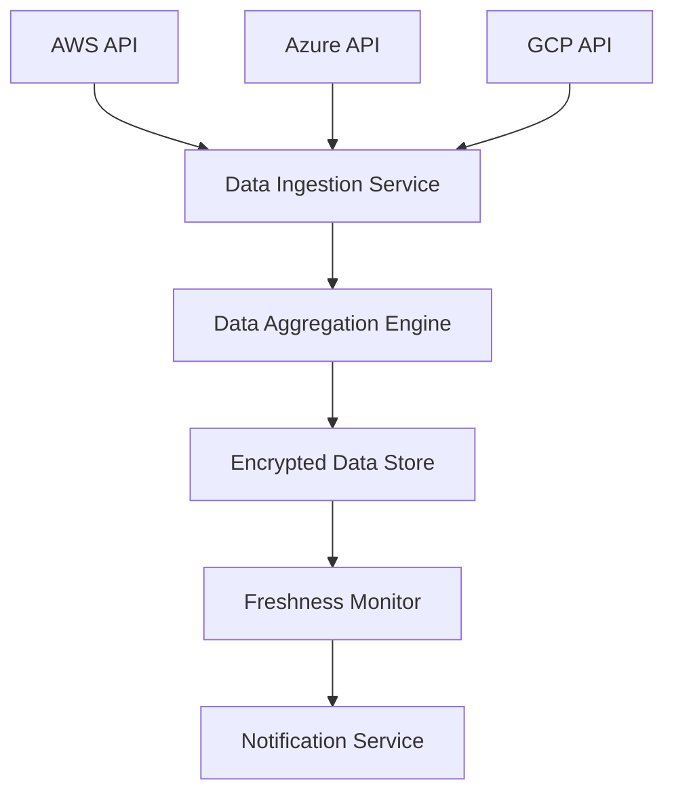

#### 1. High-Level Design

- **Summary**: This epic establishes the foundational data layer for the AI Portfolio Management Dashboard by enabling secure connections with major cloud providers (AWS, Azure, GCP) to automatically aggregate AI usage and spend data from all portfolio companies with real-time ingestion, data freshness monitoring, and automated notifications for missing or outdated data.

- **Component Flow**:

- **Integration Points**: 
  - AWS, Azure, and GCP cloud provider APIs for AI service usage and billing data
  - Portfolio companies must enable API access and provide credentials
  - Notification service for alerting users about data issues
  - Encrypted data store with TLS 1.2+ and AES-256 encryption

- **Key Assumptions**: 
  - Cloud provider APIs return usage data in JSON format with standardized billing metrics
  - Portfolio companies provide API credentials with read-only access scoped to AI services only

- **NFR Highlights**: All data encrypted in transit (TLS 1.2+) and at rest (AES-256); Dashboard load time within 3 seconds for 95% of interactions; 99.5% uptime with automated failover; Data updated within 24 hours for 95% of portfolio companies; Support up to 200 portfolio companies and 1,000 concurrent users

- **Data Flow**: The data ingestion service establishes secure connections to AWS, Azure, and GCP APIs using portfolio company credentials, retrieving AI usage and spend data at scheduled intervals. Raw data is passed to the data aggregation engine, which normalizes, validates, and consolidates information across providers and companies. Aggregated data is stored in the encrypted data store with TLS 1.2+ encryption in transit and AES-256 at rest. The freshness monitor continuously checks data timestamps and triggers the notification service to alert users when data is missing or exceeds the 24-hour freshness threshold.

#### 2. Validation Report

- **Requirements Coverage**: The design fully addresses the epic's scope including integration with all three major cloud providers (AWS, Azure, GCP), automated data aggregation, data freshness monitoring, and notifications for missing/outdated data. The architecture supports the initial release target of 50 portfolio companies with scalability to 200 companies as specified in NFRs. All security requirements are met with TLS 1.2+ for data in transit and AES-256 for data at rest. The 24-hour data freshness SLA for 95% of portfolio companies is supported through the freshness monitor component. Performance (3-second load time) and availability (99.5% uptime with automated failover) NFRs are incorporated into the design. The dependency on cloud provider API availability and portfolio company credential provisioning is explicitly acknowledged.