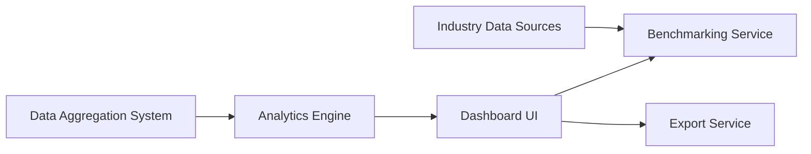

#### 1. High-Level Design

- **Summary**: This epic delivers a comprehensive dashboard interface that visualizes AI usage and spend data across the entire portfolio, enabling users to view consolidated metrics, drill down into company-specific details, customize views, access benchmarking tools, and receive AI-driven cost optimization recommendations with export capabilities for reporting.

- **Component Flow**:

- **Integration Points**: 
  - Data aggregation system for real-time AI usage and spend data
  - Industry benchmark data sources for comparative analytics
  - Business intelligence tools for advanced analytics (optional)
  - Export service for PDF and Excel report generation

- **Key Assumptions**: 
  - Industry benchmark data is available via API or data feed with monthly refresh frequency
  - Dashboard widget customization preferences are stored per-user profile

- **NFR Highlights**: Dashboard pages must load within 3 seconds for 95% of interactions with up to 50 portfolio companies; Must meet WCAG 2.1 AA accessibility standards; Support 1,000 concurrent users without performance degradation

- **Data Flow**: The data aggregation system feeds consolidated AI usage and spend data to the analytics engine, which processes metrics, performs calculations, and generates AI-driven cost optimization recommendations. The dashboard UI presents this processed data through customizable widgets and visualizations, supporting drill-down capabilities by department or project. The benchmarking service retrieves industry data from external sources and compares portfolio company performance against peers and industry averages. Users can export reports through the export service, which generates PDF and Excel formats for stakeholder communications.

#### 2. Validation Report

- **Requirements Coverage**: The design comprehensively addresses all stated requirements including consolidated portfolio views, customizable dashboards, drill-down analytics, benchmarking tools, AI-driven recommendations, and export capabilities. The NFRs for performance (3-second load time for 95% of interactions), scalability (1,000 concurrent users, 50 portfolio companies), and accessibility (WCAG 2.1 AA) are explicitly supported. The architecture separates data processing (analytics engine) from presentation (dashboard UI) and specialized services (benchmarking, export), enabling independent scaling and optimization. Integration with data aggregation and industry benchmark sources is clearly defined.