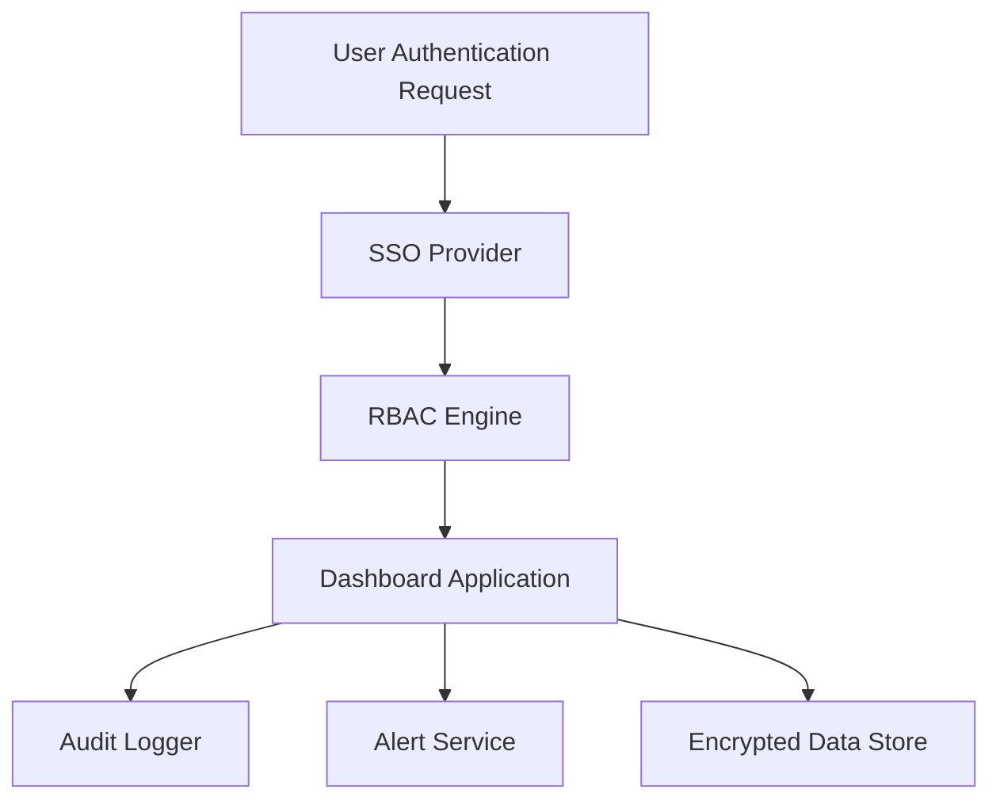

#### 1. High-Level Design

- **Summary**: This epic establishes a comprehensive security framework for the AI Portfolio Management Dashboard, implementing role-based access control (RBAC), SSO integration, audit logging, automated budget threshold alerts, and user lockout recovery mechanisms to protect sensitive portfolio company data while enabling appropriate access for different stakeholder personas.

- **Component Flow**:

- **Integration Points**: 
  - Existing SSO provider for user authentication
  - Email service for alert notifications and user recovery
  - Identity and access management systems for user provisioning
  - Encrypted data store (TLS 1.2+ in transit, AES-256 at rest)

- **Key Assumptions**: 
  - SSO provider supports standard protocols (SAML 2.0 or OAuth 2.0)
  - Email service has sufficient throughput for real-time alerts within 5-minute SLA

- **NFR Highlights**: All data in transit must use TLS 1.2+ encryption; All data at rest must use AES-256 encryption; Budget threshold alerts must be sent within 5 minutes; User lockout recovery emails within 2 minutes; 99.5% uptime required

- **Data Flow**: User authentication requests are validated through the SSO provider, then passed to the RBAC engine which determines user permissions based on role and company assignments. The dashboard application enforces these permissions for all data access requests, logging all activities to the audit logger. When AI budget thresholds are exceeded, the alert service sends notifications to Operating Partners. All sensitive data is encrypted in transit (TLS 1.2+) and at rest (AES-256) in the encrypted data store.

#### 2. Validation Report

- **Requirements Coverage**: The design fully covers the epic's stated scope including RBAC implementation, SSO integration, audit logging, automated alerts, and user lockout recovery. All NFRs for encryption (TLS 1.2+, AES-256), alert timing (5 minutes for budget alerts, 2 minutes for recovery emails), and uptime (99.5%) are addressed. The component flow demonstrates clear separation of concerns with dedicated services for authentication, authorization, auditing, and alerting. Integration dependencies with SSO provider, email service, and IAM systems are explicitly mapped.