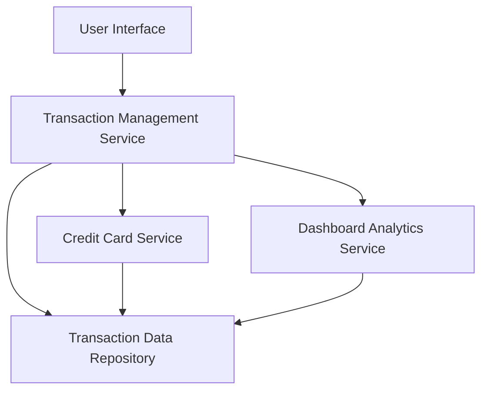

#### 1. High-Level Design

- **Summary**: This epic delivers a transaction management system that enables users to view, filter, and analyze credit card transactions across multiple cards. The core requirement is to provide granular transaction visibility with card-wise spend breakdowns, transaction history, and detailed transaction information to enhance financial transparency and control.

- **Component Flow**:

- **Integration Points**: 
  - Transaction data repository (data source for all transaction records)
  - Credit card service (provides card-level filtering capabilities)
  - Dashboard analytics service (aggregates spend data for card-level breakdowns)
  - User authentication service (secures transaction access)

- **Key Assumptions**: 
  - Transaction data is pre-categorized and stored with standardized timestamps and amounts in the repository
  - Pagination will be implemented with a default page size of 50 transactions for performance optimization

- **NFR Highlights**: Transaction data must display accurate timestamps and amounts; system must support efficient querying with pagination or lazy loading for large transaction volumes; responsive interface required.

- **Data Flow**: User requests transaction data through the UI → Transaction Management Service authenticates the request → Service queries Transaction Data Repository filtered by user and optionally by card (via Credit Card Service) → Retrieved transactions are aggregated by Dashboard Analytics Service for spend breakdowns → Formatted transaction list with card-level insights is returned to UI with pagination support → User can drill down into individual transaction details for verification.

#### 2. Validation Report

- **Requirements Coverage**: The design fully covers the epic's stated scope including transaction listing and display, card-wise transaction filtering, transaction details view, card-level spend breakdown, and multi-card transaction management. The architecture supports all specified NFRs through the Transaction Data Repository (efficient querying), pagination implementation (handling large volumes), and timestamp/amount accuracy (data integrity at repository level). All in-scope dependencies are addressed through dedicated service components, and out-of-scope items (real bank integration, transaction editing, dispute management, receipt uploads, transaction export) are explicitly excluded from the design.