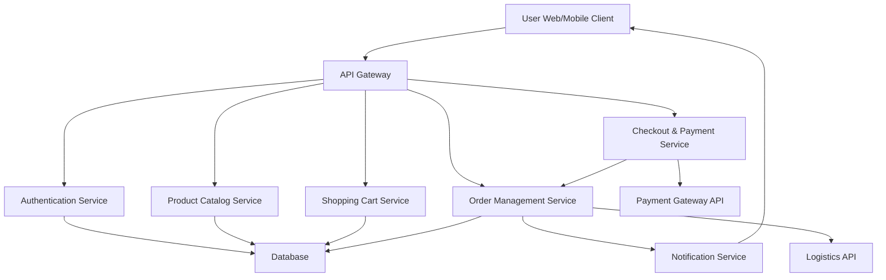

#### 1. High-Level Design

- **Summary**: This epic delivers a complete consumer shopping journey enabling product discovery through search and filtering, browsing with detailed product information and reviews, cart management, and secure multi-payment checkout. The solution is responsive across web and mobile devices with real-time notifications and order management capabilities including cancellation and refunds.

- **Component Flow**:

- **Integration Points**: 
  - **Upstream**: Third-party payment gateway APIs (for payment processing), email/SMS notification providers (for order updates), cloud hosting and CDN services (for content delivery)
  - **Downstream**: Third-party logistics APIs (for shipping status updates), database systems (for data persistence)

- **Key Assumptions**: 
  - Product catalog data is pre-populated and maintained by seller management system; payment gateway supports all required payment methods (credit/debit cards, digital wallets) with PCI DSS compliance
  - User authentication leverages existing identity provider or OAuth 2.0 standard

- **NFR Highlights**: Page load ≤2s for 95% requests; checkout ≤5s; support 100K concurrent users and 10K transactions/min; 99.9% uptime; PCI DSS compliant; data encryption; WCAG 2.1 AA accessibility

- **Data Flow**: User authenticates → browses product catalog (search/filter queries to Product Catalog Service) → adds items to cart (Cart Service persists selections) → proceeds to checkout (Checkout Service validates cart, processes payment via Payment Gateway API) → Order Management Service creates order record, triggers notifications via Notification Service, and integrates with Logistics API for shipping updates → user receives real-time order status updates

#### 2. Validation Report

- **Requirements Coverage**: The high-level design comprehensively covers all stated scope elements:
  - ✅ User registration and authentication for buyers (Authentication Service)
  - ✅ Product catalog with search and filter capabilities (Product Catalog Service)
  - ✅ Shopping cart functionality (Shopping Cart Service)
  - ✅ Secure checkout workflow (Checkout & Payment Service)
  - ✅ Payment integration supporting multiple methods (Payment Gateway API integration)
  - ✅ Product reviews and ratings (handled within Product Catalog Service)
  - ✅ Wishlist functionality (can be managed by Shopping Cart Service or separate microservice)
  - ✅ Real-time order status notifications (Notification Service)
  - ✅ Order cancellation and refund processing (Order Management Service)

- **NFR Validation**:
  - ✅ Performance: Architecture supports horizontal scaling via microservices and cloud hosting; CDN ensures fast content delivery
  - ✅ Security: API Gateway enforces authentication; Payment Gateway API ensures PCI DSS compliance; encryption enforced at data layer
  - ✅ Scalability: Microservices architecture with cloud hosting supports 100K concurrent users and 10K transactions/min
  - ✅ Availability: Cloud hosting with 99.9% SLA; distributed architecture minimizes single points of failure
  - ✅ Accessibility: Frontend implementation must adhere to WCAG 2.1 AA standards

- **Dependency Validation**: All stated dependencies are addressed in the architecture:
  - ✅ Third-party payment gateway APIs (integrated via Checkout & Payment Service)
  - ✅ Email/SMS notification providers (integrated via Notification Service)
  - ✅ Cloud hosting and CDN services (infrastructure layer)
  - ✅ Third-party logistics APIs (integrated via Order Management Service)

- **Gap Analysis**: No significant gaps identified. The design aligns with the epic scope and explicitly excludes out-of-scope items (personalized recommendations, custom payment gateway, native mobile apps, in-person shopping).

- **Risk Considerations**:
  - Payment gateway integration complexity and third-party SLA dependencies
  - Meeting 2-second page load requirement under peak load requires robust CDN and caching strategy
  - PCI DSS compliance requires rigorous security controls and regular audits
  - Real-time notification delivery depends on external provider reliability