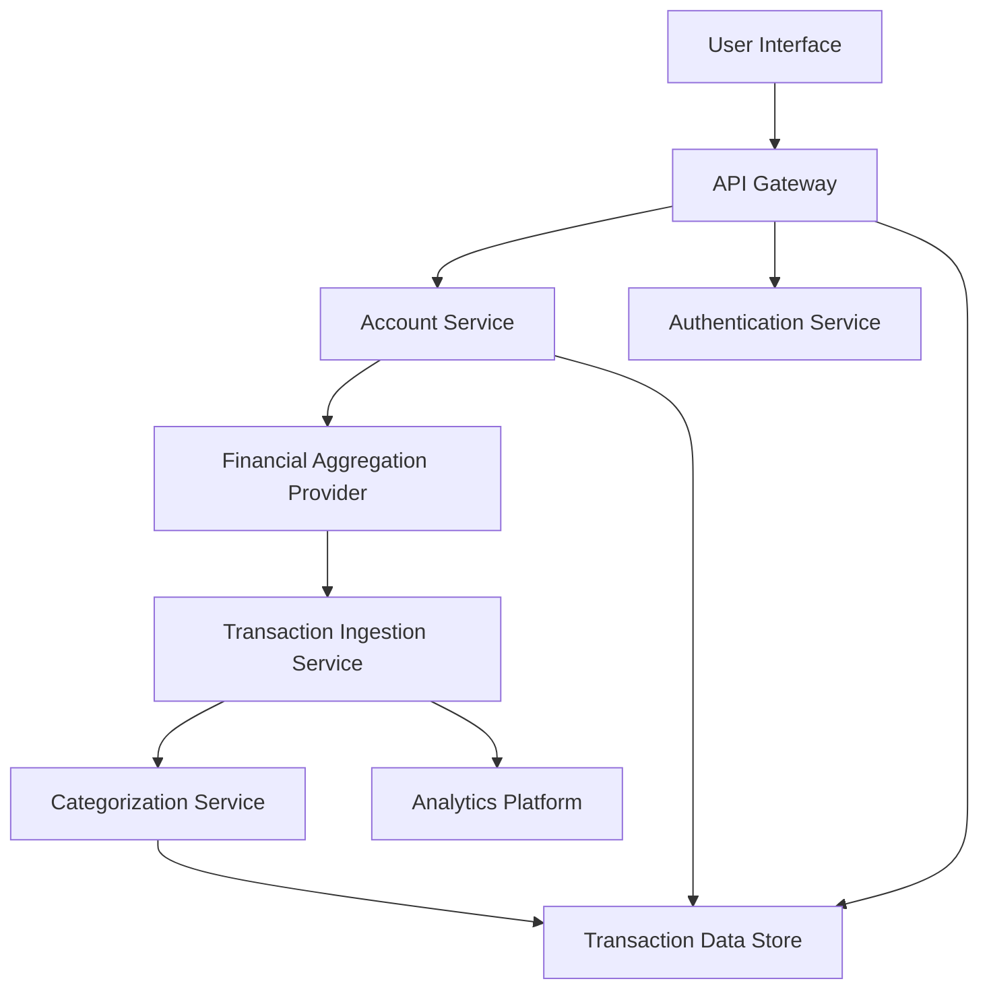

#### 1. High-Level Design

- **Summary**: This foundational epic enables users to securely connect financial accounts from multiple institutions, synchronize transaction data in real-time, and view normalized transactions with automatic categorization. Users can manage connection status, correct transaction categories, and search/filter their transaction history. This provides a unified, consolidated view of finances across all connected accounts, eliminating manual data entry and fragmented data.

- **Component Flow**:

- **Integration Points**: 
  - **External**: Financial account aggregation provider (e.g., Plaid, Yodlee) for account connectivity and transaction sync
  - **External**: Authentication/identity provider for user authentication and MFA
  - **Downstream**: Analytics and product telemetry platform for monitoring and insights

- **Key Assumptions**: 
  - Financial aggregation provider handles institution-specific authentication and data normalization
  - Transaction categorization uses a pre-trained ML model or rule-based engine with 90%+ accuracy baseline

- **NFR Highlights**: Dashboard API response p95 < 2 seconds; 99.9% monthly availability; sync jobs retryable and idempotent; 98% account sync success rate; 90% categorization accuracy; encryption in transit and at rest; least-privilege access; rate-limiting; horizontal scaling support

- **Data Flow**: Users authenticate via the Authentication Service and connect accounts through the Account Service, which communicates with the Financial Aggregation Provider. The provider pushes transaction data to the Transaction Ingestion Service, which normalizes and queues transactions. The Categorization Service applies automatic categorization rules/models and stores enriched transactions in the Transaction Data Store. Users query, filter, and export transactions via the API Gateway. User category corrections feed back to improve categorization accuracy. Sync status, errors, and telemetry flow to the Analytics Platform for monitoring and alerting.

#### 2. Validation Report

- **Requirements Coverage**: The design addresses all core functional requirements including user registration/authentication, MFA, account connection, transaction synchronization, normalization, automatic categorization, category correction, connection status display, search/filter, export, session management, and account disconnection. The architecture supports all stated NFRs including performance (p95 < 2s), availability (99.9%), sync reliability (98% success rate, idempotent jobs), categorization accuracy (90%), security (encryption, least-privilege, rate-limiting), and horizontal scaling. Dependencies on aggregation provider, authentication provider, and analytics platform are clearly defined and appropriate for the scope.