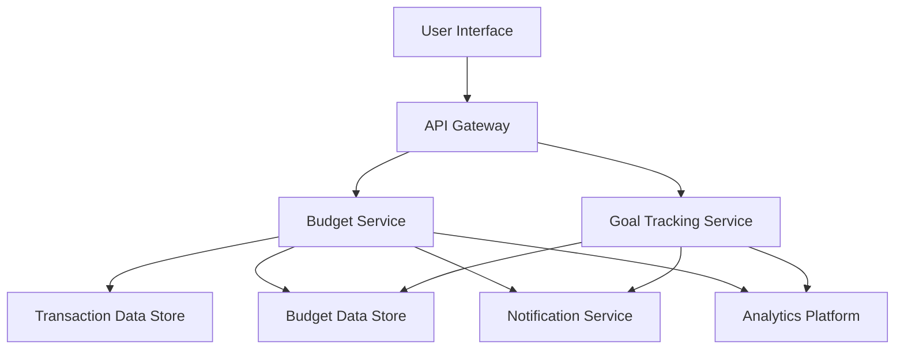

#### 1. High-Level Design

- **Summary**: This epic enables users to create and manage category-based budgets with customizable spending limits and alert thresholds. Users can monitor budget progress in real-time, receive proactive notifications when approaching or exceeding limits, and track progress toward specific financial goals (e.g., emergency funds, vacations). The system calculates projected goal completion dates based on contribution patterns and provides actionable recommendations to help users stay on track.

- **Component Flow**:

- **Integration Points**: 
  - **Upstream**: Transaction data from Account Aggregation epic (QE-4218)
  - **Downstream**: Email and push notification services for alerts, analytics and product telemetry platform

- **Key Assumptions**: 
  - Budget calculations are triggered by transaction sync events or on-demand user requests
  - Goal completion projections assume consistent contribution patterns based on historical data

- **NFR Highlights**: Dashboard API response p95 < 2 seconds; 99.9% monthly availability; horizontal scaling support; WCAG 2.2 AA accessibility; locale-aware currency and date formatting; centralized logging, metrics, and traces

- **Data Flow**: Users create budgets and goals via the UI, which are stored in the Budget Data Store. The Budget Service continuously monitors incoming transaction data from the Transaction Data Store, calculating spending against budget limits and goal progress. When thresholds are crossed or milestones reached, the system triggers notifications via the Notification Service. Budget status, goal progress, and projected completion dates are calculated on-demand and returned to the user. Usage telemetry flows to the Analytics Platform for monitoring and optimization.

#### 2. Validation Report

- **Requirements Coverage**: The design covers all functional requirements including budget creation/editing, category limits, alert configuration, progress monitoring, goal creation with target amounts and dates, contribution tracking, projected completion calculations, and notification management. The architecture supports the stated NFRs for performance (p95 < 2s), availability (99.9%), horizontal scaling, accessibility (WCAG 2.2 AA), and observability (centralized logs, metrics, traces). Dependencies on transaction data and notification services are properly identified.