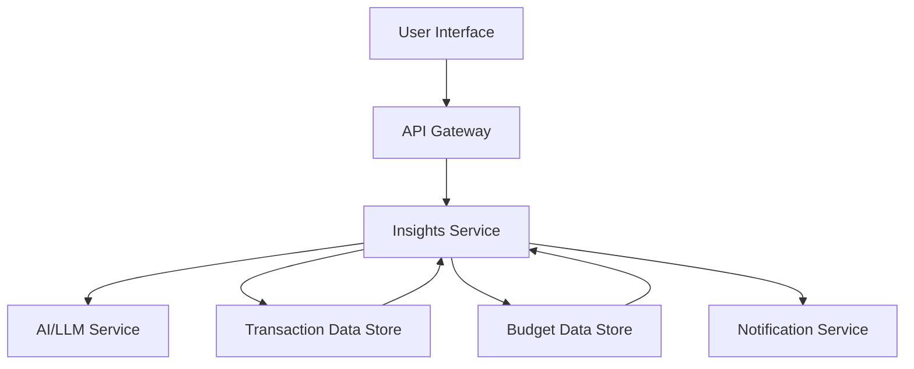

#### 1. High-Level Design

- **Summary**: This epic delivers an AI-powered financial insights engine that analyzes user transaction data to detect spending patterns, recurring subscriptions, unusual spending, and provides personalized budget recommendations. Users can query their financial data using natural language, receive cash-flow forecasts, and get transparent, explainable recommendations with supporting data. The system prioritizes user control, transparency, and education over autonomous decision-making.

- **Component Flow**:

- **Integration Points**: 
  - **Upstream**: Transaction and budget data from Account Aggregation and Budgeting epics
  - **External**: AI/LLM service with contractual data-protection controls
  - **Downstream**: Email and push notification services, analytics and product telemetry platform

- **Key Assumptions**: 
  - AI/LLM service responses will be received within acceptable latency to meet the 2-second p95 dashboard API requirement
  - Transaction data is pre-categorized and normalized before being sent to the insights engine

- **NFR Highlights**: Dashboard API response p95 < 2 seconds; 99.9% monthly availability; AI recommendations must be traceable and grounded; horizontal scaling support for AI workloads; security monitoring and audit events for AI operations

- **Data Flow**: User transaction and budget data flows from the data stores to the Insights Service, which applies AI analysis (via external AI/LLM service) to detect patterns, anomalies, and generate recommendations. Results are enriched with explanations and supporting data, then returned to the user via the API Gateway. User feedback on insights flows back to the Insights Service for personalization improvements. High-priority insights trigger notifications via the Notification Service.

#### 2. Validation Report

- **Requirements Coverage**: The design addresses all core functional requirements including spending analysis, recurring transaction detection, unusual spending identification, budget recommendations, cash-flow forecasting, natural-language queries, insight explanation, user feedback mechanisms, and AI safety controls. The architecture supports the stated NFRs for performance (p95 < 2s), availability (99.9%), horizontal scaling, and security monitoring. Integration points with transaction/budget data, AI services, and notification systems are clearly defined.