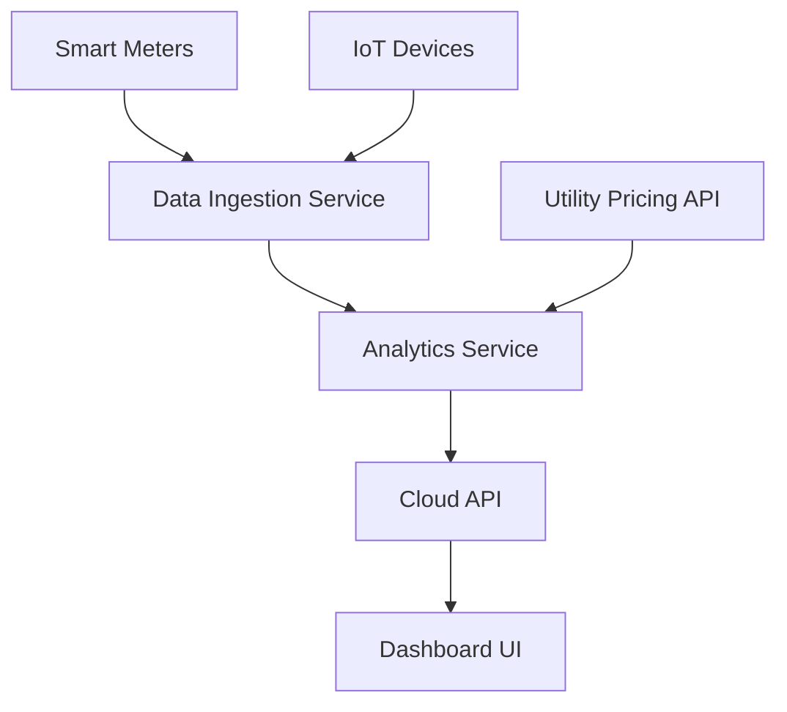

#### 1. High-Level Design

- **Summary**: This epic delivers a comprehensive real-time energy monitoring solution that enables homeowners to track household energy consumption at both aggregate and device levels. The system provides interactive dashboards with historical trends (daily/weekly/monthly), cost estimates based on utility pricing, and device management capabilities across mobile and web platforms. The solution empowers users to make data-driven decisions to reduce electricity bills by 10-25%.

- **Component Flow**:

- **Integration Points**: 
  - **Upstream**: Smart meters (real-time energy data), utility APIs (pricing data), IoT device protocols (Matter, Zigbee, Wi-Fi for device connectivity), smart appliances (device-level consumption data)
  - **Downstream**: Mobile applications (iOS/Android), web dashboard, cloud API for data processing and analytics service

- **Key Assumptions**: 
  - Smart meter data is available via standardized APIs with refresh rates of 15-60 seconds for "real-time" monitoring
  - Utility pricing data is updated at least daily and provided in a consumable API format (JSON/XML)

- **NFR Highlights**: Dashboard load time <2 seconds; 99.5% uptime; support for 100+ devices per household; end-to-end encryption; GDPR/CCPA compliance

- **Data Flow**: Smart meters and IoT devices continuously transmit energy consumption data to the Data Ingestion Service. The Analytics Service processes this data alongside utility pricing information to calculate costs, identify trends, and generate insights. Processed data is exposed through the Cloud API to the Dashboard UI, which presents real-time metrics, historical charts (daily/weekly/monthly), device-level breakdowns, and cost estimates to end users across mobile and web platforms.

#### 2. Validation Report

- **Requirements Coverage**: The design fully covers the epic's stated scope including real-time monitoring, device-level tracking, dashboard with multiple timeframes, cost estimation, trend analytics, device discovery/grouping, and device management. All NFRs (performance, scalability, security, compliance) are addressed through appropriate architectural components (encryption, cloud scalability, optimized UI). All identified dependencies (smart meters, utility APIs, IoT protocols, cloud services) are incorporated into the component flow.

- **Traceability**: Each functional requirement maps to specific components:
  - Real-time monitoring → Data Ingestion Service + Analytics Service
  - Device-level tracking → IoT Devices + Analytics Service
  - Dashboard with charts → Dashboard UI + Cloud API
  - Cost estimates → Utility Pricing API + Analytics Service
  - Device management → Dashboard UI + Cloud API

- **Gaps and Risks**: 
  - **Gap**: Epic does not specify data retention policy for historical consumption data (impacts storage architecture and compliance)
  - **Risk**: Smart meter API availability and reliability directly impacts system functionality; requires fallback/caching strategy
  - **Risk**: IoT device protocol fragmentation (Matter/Zigbee/Wi-Fi) may require significant integration effort for device discovery
  - **Risk**: Dashboard performance with 100+ devices requires optimization strategy for data aggregation and rendering

- **Compliance Check**: Design addresses GDPR/CCPA requirements through encryption and compliant data handling. End-to-end encryption satisfies security requirements. 99.5% uptime and <2s load time requirements are achievable with cloud-based architecture and CDN for UI assets.