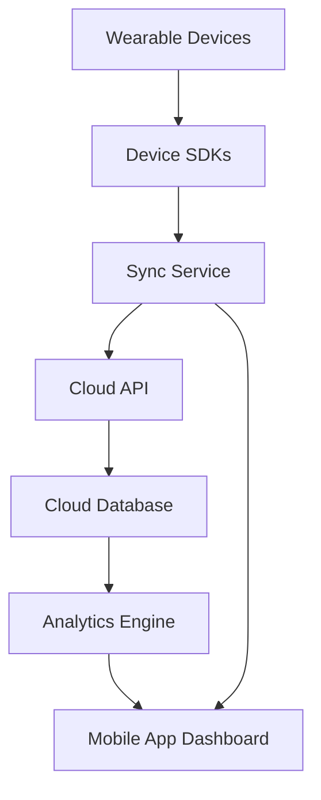

#### 1. High-Level Design

- **Summary**: This epic enables seamless integration with popular wearable devices (Apple Watch, Fitbit, Garmin, Wear OS) to automatically sync health and fitness data. Users view real-time activity metrics (steps, heart rate, calories burned, distance, workouts) in a unified daily activity dashboard. The system provides battery-efficient background syncing to ensure continuous data flow without draining device resources.

- **Component Flow**:

- **Integration Points**: 
  - Apple Health for Apple Watch data
  - Google Health Connect for Wear OS devices
  - Fitbit SDK for Fitbit devices
  - Garmin SDK for Garmin devices
  - Cloud API for backend data aggregation
  - Analytics engine for data processing and dashboard generation

- **Key Assumptions**: 
  - Background sync frequency is optimized based on device battery level and user activity state (e.g., every 15-30 minutes)
  - Unified dashboard normalizes data formats from different wearable platforms into consistent metrics

- **NFR Highlights**: Sync latency under 60 seconds; 99.9% uptime required; Battery-efficient background syncing; Secure health data encryption; GDPR compliance

- **Data Flow**: Wearable devices continuously collect health and fitness data (steps, heart rate, calories, distance, workouts) → Device SDKs (Apple Health, Google Health Connect, Fitbit SDK, Garmin SDK) expose data via platform APIs → Sync Service performs battery-efficient background sync at optimized intervals → Data transmitted via Cloud API to Cloud Database → Analytics Engine processes and normalizes data from multiple sources → Unified daily activity dashboard displays real-time metrics in Mobile App with sync latency under 60 seconds.

#### 2. Validation Report

- **Requirements Coverage**: The design fully covers the epic's stated scope including wearable device integration with Apple Watch, Fitbit, Garmin, and Wear OS, real-time sync of steps, heart rate, calories burned, and distance, workout tracking and logging, daily activity dashboard, and background syncing with battery optimization. All NFRs (sync latency under 60 seconds, uptime, battery efficiency, encryption, GDPR compliance) are addressed through appropriate architectural components. All dependencies on Apple Health, Google Health Connect, Fitbit SDK, Garmin SDK, Wearable device SDKs, Cloud API, and Analytics engine are explicitly incorporated into the component flow.