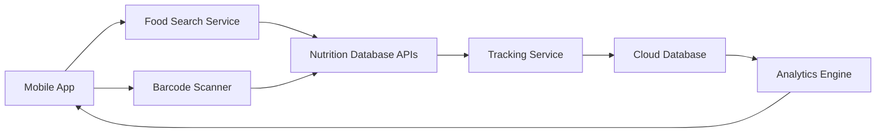

#### 1. High-Level Design

- **Summary**: This epic provides comprehensive nutrition tracking capabilities including meal logging, food search, barcode scanning for automatic food recognition, macronutrient tracking (proteins, carbs, fats), water intake logging, and nutrition target setting. The system integrates with multiple nutrition databases for accurate calorie and macro estimation and provides daily/weekly summaries of nutritional intake against targets.

- **Component Flow**:

- **Integration Points**: 
  - Multiple nutrition databases for food data and macro information
  - Cloud API for backend services
  - Analytics engine for daily/weekly summary generation
  - Recommendation engine for target alignment insights

- **Key Assumptions**: 
  - Barcode scanning uses device camera with OCR/image recognition to query nutrition databases
  - Daily summaries are generated at end of day (e.g., midnight user local time) and weekly summaries on a fixed day

- **NFR Highlights**: 99.9% uptime required; Secure health data encryption; GDPR compliance; Multiple nutrition data sources for accuracy

- **Data Flow**: User searches for food or scans barcode via mobile app → Food Search Service or Barcode Scanner queries Nutrition Database APIs → Food item with calorie and macro data returned → User logs meal with portion size → Tracking Service records entry in Cloud Database → User logs water intake similarly → Analytics Engine aggregates daily/weekly nutritional intake and compares against user-defined targets → Daily and weekly summaries with progress visualization delivered to mobile app.

#### 2. Validation Report

- **Requirements Coverage**: The design comprehensively covers all stated scope items including food search, barcode scanning, macro tracking (proteins, carbs, fats), calorie estimation, water intake logging, nutrition target setting, and daily/weekly summaries. All NFRs (uptime, encryption, GDPR compliance, multiple nutrition data sources) are addressed through appropriate architectural components and database integrations. Dependencies on Nutrition databases, Cloud API, Analytics engine, and Recommendation engine are explicitly incorporated.