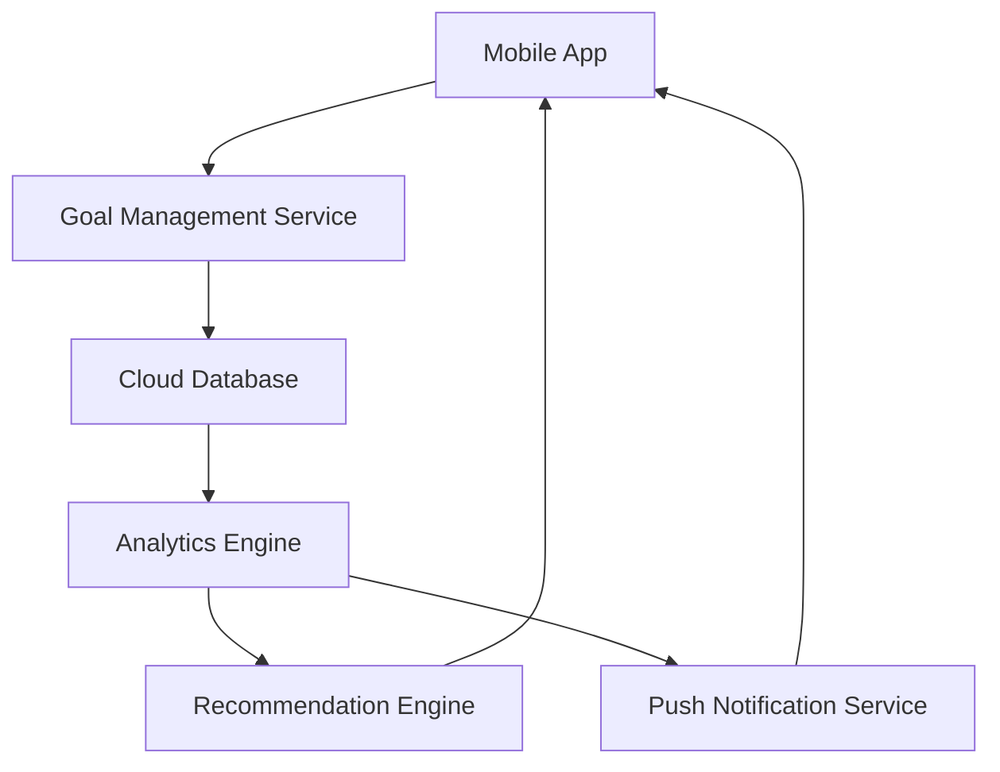

#### 1. High-Level Design

- **Summary**: This epic enables users to set personalized health and fitness goals (weight, body fat %, activity levels, nutrition objectives) and tracks progress over time. The system provides actionable insights through weekly summaries, habit correlations, personalized recommendations, push reminders, and streak tracking to build sustainable habits.

- **Component Flow**:

- **Integration Points**: 
  - Cloud API for backend services
  - Analytics engine for real-time data processing and pattern identification
  - Recommendation engine for personalized insights
  - Push notification service for reminders and alerts

- **Key Assumptions**: 
  - Weekly summary generation occurs on a fixed schedule (e.g., every Sunday evening)
  - Habit correlation analysis requires minimum 2 weeks of user data to generate meaningful insights

- **NFR Highlights**: 99.9% uptime required; Secure health data encryption; GDPR compliance; Real-time analytics processing for insights generation

- **Data Flow**: User inputs goals (weight, body fat %, activity, nutrition) via mobile app → Goal Management Service stores goals in Cloud Database → User activity and progress data continuously synced to database → Analytics Engine processes data in real-time to identify patterns and calculate progress → Recommendation Engine generates personalized insights and adjustments → Weekly summaries, habit correlations, and recommendations delivered to mobile app → Push Notification Service sends reminders and streak updates to maintain user engagement.

#### 2. Validation Report

- **Requirements Coverage**: The design fully covers the epic's stated scope including goal setting for multiple health dimensions, progress tracking and visualization, weekly summaries, habit correlation analysis, personalized recommendations, push notifications, and streak tracking. All NFRs (uptime, encryption, GDPR compliance, real-time analytics) are addressed through appropriate architectural components. Dependencies on Cloud API, Analytics engine, Recommendation engine, and Push notification service are explicitly incorporated into the component flow.