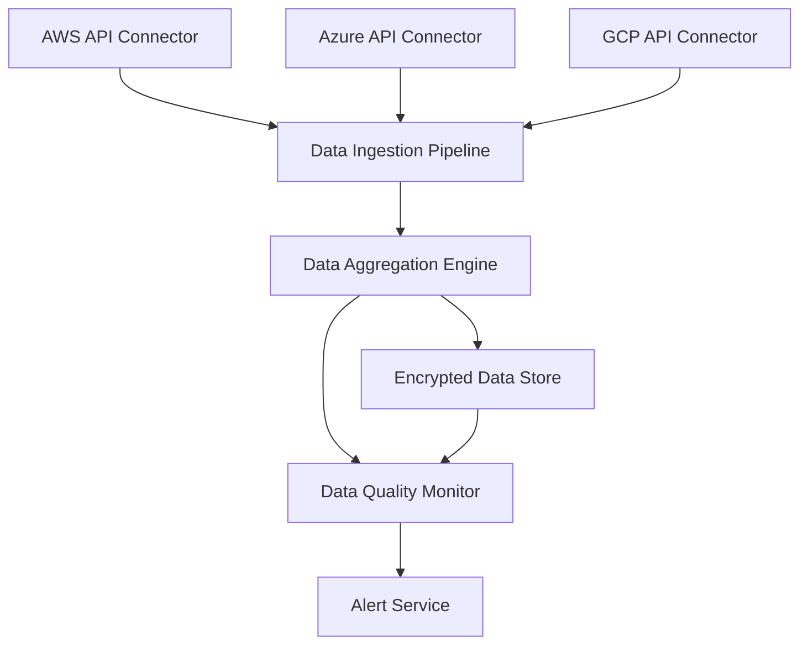

#### 1. High-Level Design

- **Summary**: This epic delivers the foundational data integration layer that enables automated collection, aggregation, and synchronization of AI usage and spend data from major cloud providers (AWS, Azure, GCP). The platform includes secure API integrations, real-time data ingestion pipelines, data freshness monitoring, and automated notification systems to ensure portfolio-wide visibility into AI technology adoption. This serves as the core data layer powering all dashboard analytics and reporting capabilities, ensuring data accuracy, completeness, and timeliness across up to 50 portfolio companies.

- **Component Flow**:

- **Integration Points**: 
  - **Upstream**: AWS/Azure/GCP cloud provider APIs for AI service data, portfolio companies' cloud environments for data access permissions, SSO provider for authentication credentials
  - **Downstream**: Portfolio Analytics Dashboard (QE-4290) consumes aggregated data, Alert Service sends notifications to stakeholders
  - **External**: Email/notification systems for data freshness alerts and budget threshold warnings

- **Key Assumptions**: 
  - Portfolio companies will grant read-only API access to their cloud provider accounts with appropriate IAM roles/service principals configured
  - AI usage data from cloud providers follows consistent billing and usage reporting schemas that can be normalized into a unified data model

- **NFR Highlights**: Dashboard pages must load within 3 seconds for 95% of interactions with data from up to 50 portfolio companies; Data must be updated within 24 hours with 95% compliance; All data encrypted using TLS 1.2+ and AES-256; System must support up to 200 portfolio companies and 1,000 concurrent users; 99.5% uptime with automated failover and daily backups

- **Data Flow**: Cloud provider API connectors (AWS, Azure, GCP) authenticate using secure credentials and poll their respective APIs on scheduled intervals (hourly or daily) to retrieve AI service usage metrics, spend data, and resource configurations. Raw data is streamed to the Data Ingestion Pipeline, which validates, cleanses, and normalizes data into a unified schema. The Data Aggregation Engine processes normalized data to calculate portfolio-level metrics, company-level summaries, department-level breakdowns, and time-series trends, then writes enriched data to the Encrypted Data Store using AES-256 encryption. The Data Quality Monitor continuously tracks data freshness timestamps, completeness metrics, and anomaly detection, triggering the Alert Service when data is missing, outdated beyond 24 hours, or budget thresholds are exceeded. The Alert Service sends real-time notifications to assigned Operating Partners and Enterprise Admins. The Encrypted Data Store serves as the single source of truth for all downstream analytics and reporting components, with data partitioned by company and time period for efficient querying.

#### 2. Validation Report

- **Requirements Coverage**: The design fully addresses the epic's scope including integration with AWS/Azure/GCP AI services via secure APIs, automated data aggregation pipelines, real-time data synchronization, data freshness indicators and monitoring, automated alerts for missing or outdated data, configurable budget threshold alerting system, data encryption in transit and at rest, and audit logging for all data access. All stated NFRs are incorporated: 3-second dashboard load time is supported through pre-aggregated data and caching in the Data Store, 24-hour data freshness with 95% compliance is enforced by the Data Quality Monitor, encryption standards (TLS 1.2+, AES-256) are implemented at API connector and storage layers, 200 portfolio company and 1,000 concurrent user scalability is achieved through horizontal scaling of ingestion pipelines and data partitioning strategies, and 99.5% uptime is ensured through automated failover mechanisms and daily backup procedures built into the cloud infrastructure.