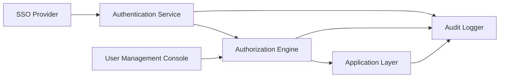

#### 1. High-Level Design

- **Summary**: This epic implements enterprise-grade security and access management capabilities to protect sensitive portfolio company data while enabling appropriate role-based access for different stakeholders. The solution includes comprehensive RBAC allowing Enterprise Admins to configure user permissions at company and role levels, SSO integration for authentication, comprehensive audit logging of all access attempts, user lockout and recovery mechanisms, and compliance with data privacy requirements ensuring Operating Partners, Deal Partners, and General Partners can only access data for their assigned portfolio companies.

- **Component Flow**:

- **Integration Points**: 
  - **Upstream**: SSO provider for user authentication, existing enterprise identity management systems
  - **Downstream**: Cloud provider security services for encryption and key management, audit log storage and monitoring systems
  - **Cross-Epic**: All application components (Dashboard, Reports, Data Access) depend on this security layer for authorization

- **Key Assumptions**: 
  - Enterprise SSO provider supports standard protocols (SAML 2.0 or OAuth 2.0/OIDC) for seamless integration
  - Portfolio company assignments will be managed through a centralized user-company mapping table maintained by Enterprise Admins

- **NFR Highlights**: All data in transit and at rest encrypted using TLS 1.2+ and AES-256; Role-based access control and audit logging mandatory; System must support 1,000 concurrent users; Unauthorized access attempts logged immediately; User lockout recovery emails sent within 2 minutes

- **Data Flow**: User authentication requests are routed to the SSO Provider, which validates credentials and returns identity tokens to the Authentication Service. The Authentication Service extracts user identity and roles, then queries the Authorization Engine to retrieve company-level permissions and role-based access policies. The Authorization Engine evaluates permissions against the requested resource (company data, reports, admin functions) and returns an authorization decision. All authentication attempts, authorization decisions, and access events are streamed to the Audit Logger for compliance tracking. Enterprise Admins interact with the User Management Console to assign/revoke permissions, which updates the Authorization Engine's policy store. Once authorized, requests flow to the Application Layer with security context attached, and all subsequent data access is filtered based on the user's assigned companies and role permissions.

#### 2. Validation Report

- **Requirements Coverage**: The design comprehensively covers the epic's scope including role-based access control by user and company, SSO integration for user authentication, user permission assignment and revocation, audit logging of access attempts and security events, user lockout and recovery mechanisms, data privacy controls and anonymization, compliance with security standards, and access log review and monitoring capabilities. All stated NFRs are addressed: encryption standards (TLS 1.2+, AES-256) are enforced at the Authentication Service and cloud provider integration layer, 1,000 concurrent user support is achieved through stateless authentication token design, immediate logging of unauthorized access is handled by the Audit Logger's real-time streaming architecture, and 2-minute user lockout recovery is enabled through the User Management Console's automated email notification system.