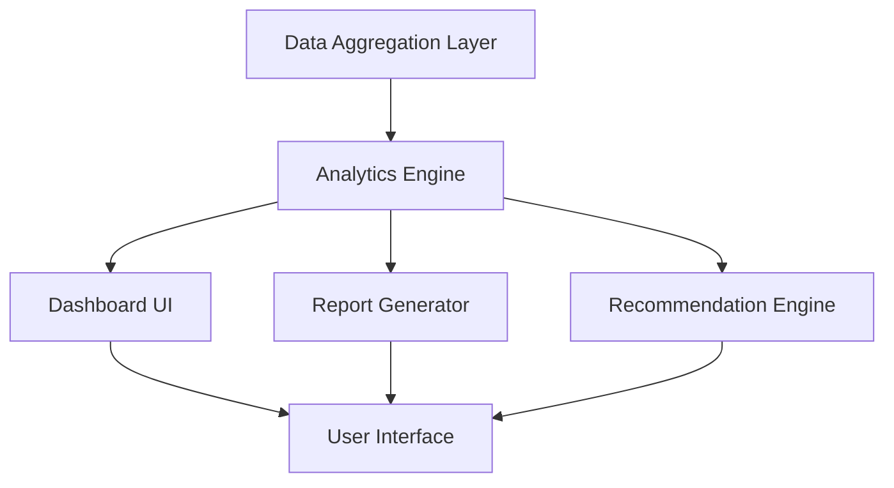

#### 1. High-Level Design

- **Summary**: This epic delivers a comprehensive analytics and reporting platform that transforms AI usage data into actionable insights through real-time dashboards, customizable widgets, benchmarking tools, drill-down analytics, automated report generation, and AI-driven cost optimization recommendations. The solution serves multiple stakeholder personas (Operating Partners, Deal Partners, General Partners) with both technical and non-technical visualizations to drive cost reduction and value creation decisions across portfolio companies.

- **Component Flow**:

- **Integration Points**: 
  - **Upstream**: AI Data Integration and Aggregation Platform (QE-4288) for source data
  - **Downstream**: Cloud provider analytics services, reporting and visualization libraries (PDF/Excel export), accessibility testing tools
  - **External**: Browser clients for dashboard access, email systems for report delivery

- **Key Assumptions**: 
  - Portfolio companies will have standardized data schemas from the integration platform enabling consistent cross-company benchmarking
  - AI-driven cost optimization recommendations will leverage machine learning models trained on historical portfolio data patterns

- **NFR Highlights**: Dashboard pages must load within 3 seconds for 95% of interactions; System must support up to 200 portfolio companies and 1,000 concurrent users; Reports generated within 10 seconds; WCAG 2.1 AA accessibility compliance; 99.5% uptime required

- **Data Flow**: Raw AI usage and spend data flows from the Data Aggregation Layer to the Analytics Engine, which processes and enriches it with benchmarking metrics, trend analysis, and cost patterns. The Analytics Engine feeds three parallel streams: (1) real-time dashboard widgets displaying KPIs and visualizations through the Dashboard UI, (2) scheduled or on-demand reports generated as PDF/Excel through the Report Generator, and (3) AI-driven insights and recommendations through the Recommendation Engine. All three streams converge at the User Interface layer, which presents personalized views based on user roles and preferences, with all interactions logged for audit purposes.

#### 2. Validation Report

- **Requirements Coverage**: The design fully addresses the epic's scope including consolidated real-time portfolio dashboard view, customizable widgets and saved views, benchmarking tools for cross-company and industry comparison, drill-down analytics by department and project, automated PDF and Excel report export, executive summary generation, AI-driven cost optimization recommendations, scenario simulation for vendor consolidation, data visualization for technical and non-technical users, and WCAG 2.1 AA accessibility compliance. All stated NFRs (3-second load time, 200 portfolio companies, 1,000 concurrent users, 10-second report generation, 99.5% uptime) are explicitly incorporated into the architecture through the separation of concerns between analytics processing and presentation layers, enabling horizontal scaling and caching strategies.