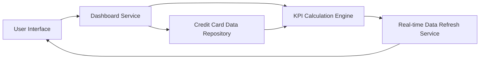

#### 1. High-Level Design

- **Summary**: This epic enables users to view a consolidated dashboard displaying all credit cards with key performance indicators including monthly spend, total credit limit, available credit, and outstanding amounts. The dashboard provides a single interface for monitoring financial health across multiple credit cards with real-time visibility.

- **Component Flow**:

- **Integration Points**: 
  - Upstream: Credit card data source/repository for retrieving card details, balances, and limits
  - Integration with responsive layout framework for cross-device compatibility
  - Real-time data refresh mechanism for KPI metric updates

- **Key Assumptions**: 
  - Credit card data repository provides current balance, limit, and transaction data with sufficient freshness for real-time display
  - Available credit is calculated as (Total Credit Limit - Outstanding Amount) by the KPI Calculation Engine

- **NFR Highlights**: System must support responsive design across desktop, tablet, and mobile devices; Dashboard load time must be under 2 seconds; Real-time data refresh capability for KPI metrics

- **Data Flow**: User accesses dashboard → Dashboard Service queries Credit Card Data Repository for all user's credit cards → KPI Calculation Engine computes monthly spend, available credit (limit minus outstanding), and aggregates portfolio metrics → Real-time Data Refresh Service ensures data freshness → Responsive UI renders consolidated view with all cards and KPIs (monthly spend, total credit limit, available credit, outstanding amounts) → Dashboard displays within 2 seconds across all device types

#### 2. Validation Report

- **Requirements Coverage**: The design fully covers all scope items including dashboard KPIs display, monthly spend tracking, total credit limit visualization, available credit calculation, outstanding amount monitoring, multiple credit card view, and responsive layout design. The architecture satisfies all NFR requirements for responsive design across devices, sub-2-second dashboard load time, and real-time data refresh capability. Integration with credit card data repository is clearly defined and supports the required KPI calculations.