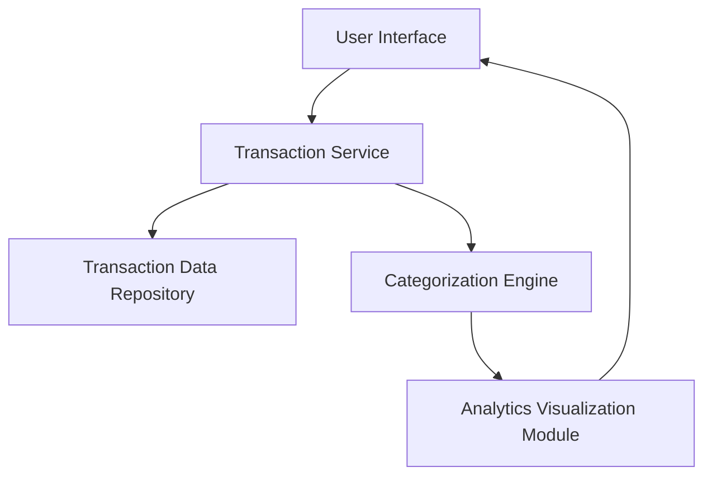

#### 1. High-Level Design

- **Summary**: This epic provides comprehensive transaction visibility and spending analytics across all credit cards. Users can view detailed transaction histories and analyze spending patterns through interactive visualizations broken down by categories (Food & Dining, Fuel, Shopping, Travel, Entertainment, Utilities, Healthcare, Education, Miscellaneous).

- **Component Flow**:

- **Integration Points**: 
  - Upstream: Transaction data repository for historical and current transaction records
  - Upstream: Categorization engine or service for expense classification into predefined categories
  - Integration with filtering and search capabilities for transaction lookup

- **Key Assumptions**: 
  - Transactions are automatically categorized by the categorization engine upon ingestion or retrieval
  - Multi-card transaction data is stored with consistent schema and card identifiers

- **NFR Highlights**: System must handle transaction data for multiple cards efficiently; Analytics visualizations must render within 1 second; Support for historical transaction data storage and retrieval

- **Data Flow**: User accesses transaction monitoring interface → Transaction Service retrieves transaction records from Transaction Data Repository for selected cards and time period → Categorization Engine classifies transactions into 9 predefined categories → Analytics Visualization Module aggregates spending by category and generates interactive charts → User views detailed transaction list with filtering/search options and category-wise spending breakdowns with visual analytics

#### 2. Validation Report

- **Requirements Coverage**: The design addresses all scope requirements including transaction listing and viewing, category-wise spending visualization, interactive analytics charts, multi-category support for all 9 specified categories, and transaction filtering and search. The architecture supports NFR requirements for efficient multi-card data handling, 1-second visualization rendering, and historical data storage/retrieval. Dependencies on transaction data repository and categorization engine are properly integrated.