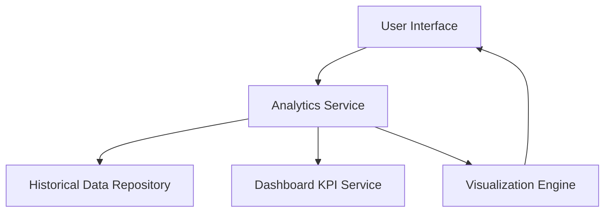

#### 1. High-Level Design

- **Summary**: This epic delivers advanced analytical capabilities for tracking monthly spending trends over time and performing card-wise spend analysis. Users can compare spending patterns across different months, identify seasonal trends, and analyze individual card usage to optimize credit card portfolio management.

- **Component Flow**:

- **Integration Points**: 
  - Upstream: Historical transaction and spending data repository
  - Downstream: Dashboard KPI service for consistent data representation
  - Integration with visualization components for trend charts and card comparison views

- **Key Assumptions**: 
  - Transaction data is pre-categorized and stored in a queryable format with monthly aggregations
  - Card identifiers are consistent across the historical data repository and dashboard KPI service

- **NFR Highlights**: System must support at least 12 months of historical trend data; Trend calculations and visualizations must complete within 2 seconds; Data accuracy must be maintained across all analytical views

- **Data Flow**: User requests trend analysis through UI → Analytics Service queries Historical Data Repository for 12 months of spending data → Service aggregates data by month and by card → Results are cross-validated with Dashboard KPI Service for consistency → Visualization Engine renders trend charts and card comparison metrics → Interactive visualizations are displayed to user with monthly comparisons and card performance insights

#### 2. Validation Report

- **Requirements Coverage**: The design covers all stated scope items including monthly spend trend visualization, card-wise spend comparison, historical spending analysis, trend identification and reporting, multi-month data comparison, and card performance metrics. The architecture supports the NFR requirements for 12 months of historical data, 2-second response time for calculations, and data accuracy across views. Integration points with historical data repository and dashboard KPI service are clearly defined.