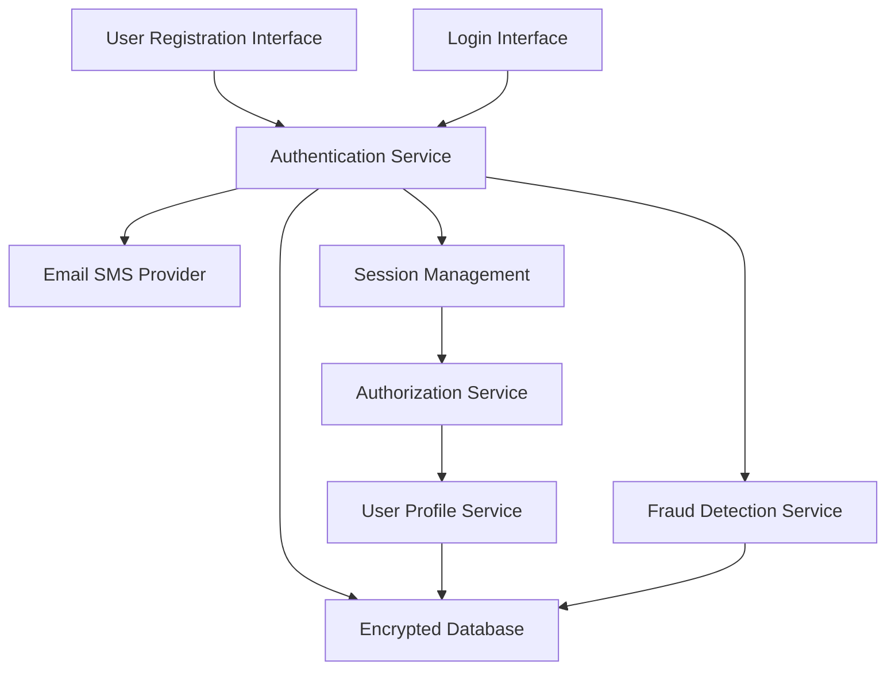

#### 1. High-Level Design

- **Summary**: This epic establishes the foundational security and identity management layer for the platform, enabling user registration, secure authentication, and role-based access control for buyers, sellers, and administrators. It implements comprehensive security measures including encrypted data storage, fraud detection, account verification, and suspicious activity lockout to create a trusted environment for all platform interactions. The solution ensures that each user type has appropriate access to platform features based on their role.

- **Component Flow**:

- **Integration Points**: 
  - Cloud hosting services for scalable infrastructure and secure data storage
  - Email/SMS notification providers for account verification and security alerts
  - Third-party fraud detection services for real-time risk assessment

- **Key Assumptions**: 
  - User passwords are hashed using industry-standard algorithms (e.g., bcrypt) with per-user salts
  - Session tokens expire after 30 minutes of inactivity and are stored server-side with secure flags

- **NFR Highlights**: All user data encrypted at rest and in transit; PCI DSS compliance for payment processing; fraud detection and account lockout for suspicious activity; 100,000 concurrent users; 99.9% uptime SLA; WCAG 2.1 AA accessibility; page load times ≤2 seconds for 95% of requests

- **Data Flow**: New users submit registration details through the User Registration Interface to the Authentication Service, which validates input, checks for duplicate accounts via the Encrypted Database, and triggers account verification emails/SMS through the Email SMS Provider. The Fraud Detection Service analyzes registration patterns and flags suspicious accounts. During login, users submit credentials via the Login Interface to the Authentication Service, which verifies credentials against the Encrypted Database, checks account status (active/locked), and creates secure sessions in Session Management. The Authorization Service validates session tokens and enforces role-based access control (buyer/seller/admin) for each request, querying user roles from the User Profile Service. The User Profile Service manages user data updates and retrieves profile information from the Encrypted Database. Account lockout is triggered automatically after multiple failed login attempts or when fraud detection thresholds are exceeded.

#### 2. Validation Report

- **Requirements Coverage**: The design comprehensively covers all requirements including user registration for buyers/sellers, secure authentication and login, role-based access control for consumers/sellers/admins, account verification, fraud detection, encrypted data storage, account lockout for suspicious activity, and user profile management. All NFRs (data encryption, PCI DSS compliance, fraud detection and lockout, 100K concurrent users, 99.9% uptime, WCAG 2.1 AA accessibility, 2-second page load) are supported through the proposed architecture with dedicated services for authentication, authorization, fraud detection, and secure session management, backed by encrypted database storage and cloud infrastructure.