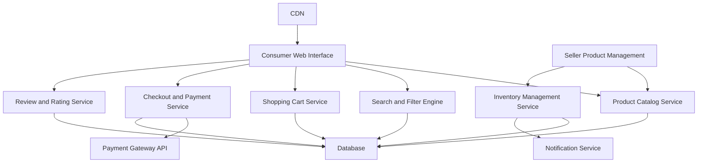

#### 1. High-Level Design

- **Summary**: This epic provides a full-featured e-commerce product catalog with advanced search, filtering, and sorting capabilities. It enables consumers to browse products, add items to cart, complete secure checkout with integrated payment processing, read/write reviews and ratings, and manage wishlists. Sellers can list products with rich media, manage inventory, and receive low-stock alerts. The solution emphasizes responsive design, real-time inventory visibility, and fast page load times to deliver an optimal shopping experience across devices.

- **Component Flow**:

- **Integration Points**: 
  - Third-party payment gateway APIs (PCI DSS compliant) for secure transaction processing
  - Cloud hosting and CDN services for responsive design and fast content delivery
  - Email/SMS notification providers for order confirmations and inventory alerts

- **Key Assumptions**: 
  - Product images are stored in CDN with automatic optimization for different device resolutions
  - Inventory updates from sellers propagate to the catalog within 1 second to prevent overselling

- **NFR Highlights**: Page load times ≤2 seconds for 95% of requests; checkout completion within 5 seconds; 10,000 transactions per minute with horizontal scaling; all transactions encrypted; PCI DSS compliance; WCAG 2.1 AA accessibility; keyboard and screen reader support

- **Data Flow**: Consumers interact with the Product Catalog Service through the Web Interface to browse products, with the Search and Filter Engine querying the Database for matching results. Static assets (images, CSS, JS) are served via CDN for fast load times. Selected products are added to the Shopping Cart Service, which maintains session state in the Database. During checkout, the Checkout and Payment Service validates cart contents, checks inventory availability via the Inventory Management Service, processes payment through the Payment Gateway API, and persists order details to the Database. Post-purchase, consumers submit reviews through the Review and Rating Service. Sellers manage product listings and inventory through the Seller Product Management interface, with the Inventory Management Service triggering low-stock alerts via the Notification Service when thresholds are reached.

#### 2. Validation Report

- **Requirements Coverage**: The design fully addresses all requirements including product catalog with search/filter/sort, shopping cart, secure checkout, payment integration, product listing, inventory management, reviews/ratings, wishlist, real-time inventory alerts, and responsive design. All NFRs (2-second page load, 5-second checkout, 10K transactions/minute, encryption, PCI DSS compliance, WCAG 2.1 AA accessibility, keyboard/screen reader support) are supported through the proposed architecture with dedicated services for search, cart, checkout, payment, reviews, and inventory, complemented by CDN for performance and horizontal scaling capabilities.