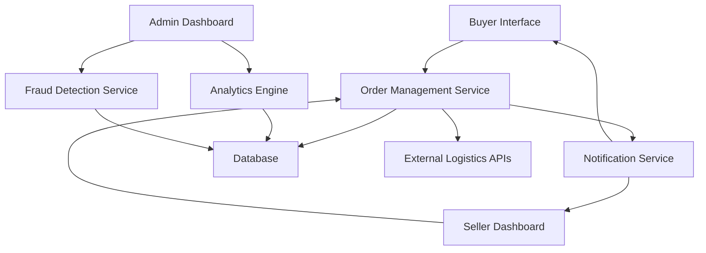

#### 1. High-Level Design

- **Summary**: This epic delivers a comprehensive order lifecycle management system enabling buyers to track orders in real-time, cancel orders, and request refunds. Sellers receive a dashboard for order processing, sales analytics, and inventory management. Administrators gain platform oversight tools including analytics dashboards, fraud detection, dispute resolution, and user permission management. The system includes automated notifications and recovery mechanisms to ensure platform reliability and integrity.

- **Component Flow**:

- **Integration Points**: 
  - Email/SMS notification providers for order status updates and alerts
  - Third-party logistics APIs for real-time shipping updates
  - Cloud hosting services for infrastructure and automated failover
  - Fraud detection algorithms and services for seller account monitoring

- **Key Assumptions**: 
  - Order status updates are pushed via webhook from logistics providers with sub-second latency
  - Fraud detection scoring is performed asynchronously and does not block order processing

- **NFR Highlights**: Real-time order status updates; 12-hour average order processing; 100,000 concurrent users; 99.9% uptime SLA; 30-minute recovery from critical failures; automated failover; regional data privacy compliance; WCAG 2.1 AA accessibility

- **Data Flow**: Buyers submit order status queries and cancellation/refund requests through the Buyer Interface to the Order Management Service, which retrieves data from the Database and external Logistics APIs. Sellers access order processing queues, sales reports, and inventory levels via the Seller Dashboard, with the Order Management Service aggregating data from the Database. Administrators view platform health metrics from the Analytics Engine and fraud alerts from the Fraud Detection Service, both querying the Database. The Notification Service monitors order state changes and triggers real-time email/SMS notifications to buyers and sellers. All critical data is persisted in the Database with automated backup and failover mechanisms.

#### 2. Validation Report

- **Requirements Coverage**: The design comprehensively addresses all stated requirements including order tracking, cancellation, refunds, seller dashboard with analytics, admin oversight tools, fraud detection, dispute resolution, notifications, and automated recovery mechanisms. All NFRs (real-time updates, 100K concurrent users, 99.9% uptime, 30-minute recovery, data privacy compliance, accessibility) are supported through the proposed architecture with dedicated services for analytics, fraud detection, and notifications, backed by cloud infrastructure with failover capabilities.