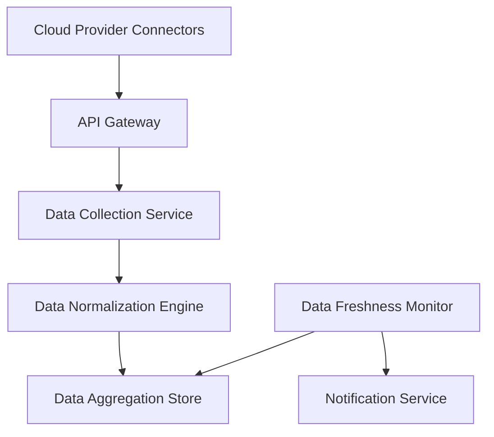

#### 1. High-Level Design

**Summary:** This epic enables automated integration with major cloud AI providers (AWS, Azure, GCP) to aggregate AI usage and spend data from all portfolio companies. The system collects, normalizes, and consolidates data through secure APIs, providing real-time visibility into AI technology adoption across the entire portfolio. It includes data freshness monitoring, automated synchronization, and notification mechanisms to alert users when data is missing or outdated.

**Component Flow:**

**Integration Points:**
- **Upstream:** AWS AI services APIs (SageMaker, Bedrock, Comprehend, Rekognition, etc.)
- **Upstream:** Azure AI services APIs (Azure OpenAI, Cognitive Services, Machine Learning, etc.)
- **Upstream:** GCP AI services APIs (Vertex AI, Cloud AI Platform, Vision AI, etc.)
- **Upstream:** Portfolio companies' cloud provider access credentials and IAM permissions
- **Downstream:** Data Aggregation Store feeds the Dashboard Visualization layer (Epic QE-4316)
- **Downstream:** Notification Service for data freshness alerts

**Key Assumptions:**
- Each portfolio company provides read-only API credentials or IAM roles with permissions to access billing and usage data from their cloud AI services
- Cloud provider APIs return usage data in their native formats (JSON), which are normalized to a common schema (fields: company_id, service_name, usage_quantity, cost, timestamp, region) before storage

**NFR Highlights:** Dashboard loads within 3 seconds for up to 50 companies; supports up to 200 companies and 1,000 concurrent users; all data encrypted using TLS 1.2+ and AES-256; 99.5% uptime with automated failover; 95% of data updated within 24 hours

**Data Flow:** The Cloud Provider Connectors establish secure connections to AWS, Azure, and GCP APIs using portfolio company credentials. The API Gateway routes requests and implements rate limiting and retry logic. The Data Collection Service orchestrates scheduled data pulls (e.g., hourly or daily) from each cloud provider, retrieving billing and usage metrics for AI services. The Data Normalization Engine transforms provider-specific data formats into a unified schema, handling currency conversion, timezone normalization, and service name mapping. Normalized data is stored in the Data Aggregation Store (likely a time-series or relational database optimized for analytics). The Data Freshness Monitor continuously checks the last update timestamp for each portfolio company and triggers the Notification Service to alert Operating Partners when data exceeds the 24-hour freshness threshold (AC4). The Data Aggregation Store serves as the single source of truth for all downstream analytics and visualization components.

#### 2. Validation Report

**Requirements Coverage:** The design fully addresses the epic's scope including integration with AWS/Azure/GCP AI services (FR1), automated data aggregation (FR2), data freshness indicators and monitoring (FR6), notifications for missing/outdated data (FR6, AC4), secure encryption (TLS 1.2+, AES-256), and API versioning with fallback mechanisms. The architecture supports all NFRs: 3-second dashboard load time, 200 company scalability, 1,000 concurrent users, 99.5% uptime, and 95% data freshness within 24 hours. The component design enables independent scaling of data collection per cloud provider.

**Gap Analysis:** No significant gaps identified. The design covers all must-have functional requirements (FR1, FR2, FR6) related to data integration and aggregation. The API Gateway component provides the versioning and fallback mechanisms mentioned in the epic scope. Acceptance criteria AC1 (data displayed within 3 seconds, no older than 24 hours) and AC4 (data freshness warnings) are fully supported.

**Risk Assessment:**
- **High Risk:** Cloud provider API changes or outages. Mitigation: implement API versioning with backward compatibility; monitor provider status pages; maintain fallback to cached data; establish SLAs with cloud providers where possible.
- **Medium Risk:** Portfolio company credential expiration or permission changes. Mitigation: implement automated credential validation checks; send proactive alerts to Enterprise Admins when credentials are nearing expiration or access fails.
- **Medium Risk:** Data privacy concerns from portfolio companies. Mitigation: implement strict RBAC (Epic QE-4317) to ensure users only see authorized company data; provide data anonymization options; maintain comprehensive audit logs.

**Compliance & Security:** Design implements end-to-end encryption (TLS 1.2+ for API calls, AES-256 for stored data) per security requirements. Secure credential management integrates with cloud provider IAM best practices (using roles instead of long-lived keys where possible). Audit logging tracks all data access and API calls for compliance. The architecture supports the 99.5% uptime SLA through automated failover and daily backups.