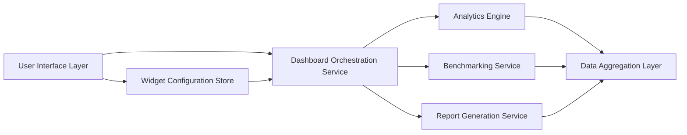

#### 1. High-Level Design

**Summary:** This epic delivers a comprehensive, user-friendly dashboard that visualizes consolidated AI usage and spend data across all portfolio companies. The dashboard provides real-time metrics, customizable widgets, drill-down analytics by department/project, benchmarking tools for cross-company and industry comparisons, executive summaries, and cost-saving recommendations. Users can personalize views and export reports in PDF and Excel formats.

**Component Flow:**

**Integration Points:**
- **Upstream:** Data aggregation layer from cloud provider integrations (AWS, Azure, GCP)
- **Upstream:** User authentication via SSO provider for secure access
- **Upstream:** Industry benchmark data sources for comparative analytics (external data providers)
- **Downstream:** PDF/Excel export libraries for report generation

**Key Assumptions:**
- Industry benchmark data is provided via third-party API or periodic data feeds in standardized format (JSON/CSV), updated monthly or quarterly
- Dashboard widgets use a predefined library of visualization types (charts, tables, KPIs) with configuration stored per user profile; custom widget development is out of scope for initial release

**NFR Highlights:** Dashboard pages load within 3 seconds for 95% of interactions; supports 1,000 concurrent users; meets WCAG 2.1 AA accessibility standards including keyboard navigation and screen reader compatibility

**Data Flow:** Users interact with the UI Layer to select companies, date ranges, and metrics. The Dashboard Orchestration Service retrieves user-specific widget configurations from the Widget Configuration Store and coordinates data requests. The Analytics Engine processes drill-down queries (by company/department/project) against the Data Aggregation Layer, which contains normalized AI usage and spend data. The Benchmarking Service compares portfolio company metrics against industry averages from external data sources. The Report Generation Service compiles selected data into PDF or Excel format for export. All responses are optimized to meet the 3-second load time requirement through caching and query optimization.

#### 2. Validation Report

**Requirements Coverage:** The design fully addresses the epic's scope including consolidated real-time dashboard (FR2), customizable widgets (FR8), drill-down analytics (FR9), benchmarking tools (FR7), executive summaries, cost-saving recommendations (FR10), and report export (FR5). The architecture supports all NFRs: 3-second load time for 95% of interactions, 1,000 concurrent users, and WCAG 2.1 AA accessibility compliance. The component separation enables independent scaling of analytics, benchmarking, and reporting functions.

**Gap Analysis:** No significant gaps identified. The design covers all must-have functional requirements (FR2, FR5) and should-have requirements (FR7, FR8, FR9) related to visualization and analytics. The nice-to-have AI-driven recommendations (FR10) are included in the Analytics Engine component.

**Risk Assessment:**
- **Low Risk:** Performance degradation with large datasets. Mitigation: implement data pagination, lazy loading, and caching strategies; use indexed queries on the Data Aggregation Layer.
- **Medium Risk:** Industry benchmark data source availability or quality issues. Mitigation: establish SLAs with data providers; implement fallback to historical averages if external data is unavailable.

**Compliance & Security:** Design integrates with SSO for authentication and inherits access controls from the RBAC system (Epic QE-4317). Accessibility compliance (WCAG 2.1 AA) is built into the UI Layer with keyboard navigation and screen reader support per AC8.