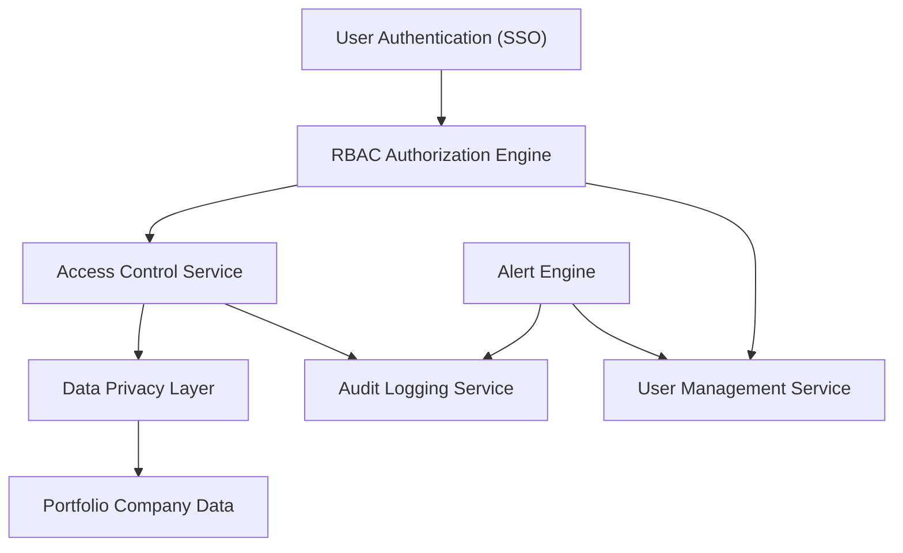

#### 1. High-Level Design

**Summary:** This epic establishes a comprehensive security framework for the AI Portfolio Management Dashboard, implementing role-based access control (RBAC) that enables Enterprise Admins to configure user permissions, manage integrations, and restrict data access by company and role. The system includes audit logging, automated budget threshold alerting, user lockout recovery, and data privacy controls to ensure secure, compliant access to sensitive portfolio company data.

**Component Flow:**

**Integration Points:**
- **Upstream:** SSO provider for user authentication and identity management
- **Upstream:** Cloud provider APIs for secure credential management
- **Downstream:** Email service for alert notifications and password reset emails
- **Internal:** Audit logging infrastructure for compliance tracking and security event monitoring

**Key Assumptions:**
- SSO provider supports standard protocols (SAML 2.0 or OAuth 2.0) and can provide user identity claims including email and role attributes
- Budget thresholds are configured per portfolio company with default values, and threshold breach detection runs on a scheduled polling mechanism (e.g., every 5 minutes)

**NFR Highlights:** All data encrypted using TLS 1.2+ (transit) and AES-256 (at rest); budget alerts sent within 5 minutes of breach; lockout recovery emails within 2 minutes; 99.5% uptime with automated failover

**Data Flow:** User credentials flow from SSO provider to RBAC engine for authentication. Upon successful authentication, the RBAC engine validates user permissions against company-level access rules stored in the Access Control Service. When users request portfolio data, the Data Privacy Layer filters and anonymizes data based on their assigned permissions before returning results. Simultaneously, all access attempts are logged to the Audit Logging Service. The Alert Engine continuously monitors portfolio company AI spend against configured thresholds and triggers email notifications via the email service when breaches occur. User lockout events trigger automated recovery workflows through the User Management Service.

#### 2. Validation Report

**Requirements Coverage:** The design fully addresses the epic's scope including RBAC with company-level restrictions (FR3), automated budget threshold alerts (FR4), audit logging for security events, SSO integration for authentication, user lockout recovery (AC7), and data privacy controls. The architecture supports all stated NFRs: encryption standards (TLS 1.2+, AES-256), alert timing (5 minutes), recovery email timing (2 minutes), and 99.5% uptime. The component flow demonstrates clear separation of concerns between authentication, authorization, auditing, and alerting functions.

**Gap Analysis:** No significant gaps identified. The design covers all functional requirements (FR3, FR4, FR6) and acceptance criteria (AC2, AC3, AC7) related to security and access control. The audit logging component satisfies compliance requirements, and the alert engine addresses proactive cost management needs.

**Risk Assessment:** 
- **Medium Risk:** SSO provider outages could block all user access. Mitigation: implement local authentication fallback for emergency admin access.
- **Medium Risk:** Email service delays could impact alert SLA (5 minutes). Mitigation: use enterprise-grade email service with guaranteed delivery SLA and implement retry logic.

**Compliance & Security:** Design meets industry-standard security practices with encryption at rest and in transit, comprehensive audit logging, and RBAC. Supports regulatory compliance through detailed access logs and data privacy controls. Unauthorized access attempts are logged immediately per requirements.