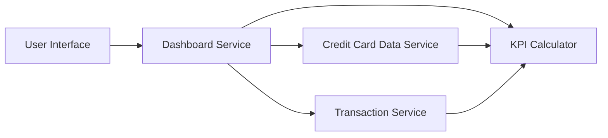

#### 1. High-Level Design

- **Summary:** This epic delivers a consolidated dashboard that provides users with real-time visibility into key financial metrics across their entire credit card portfolio. The dashboard displays critical KPIs including monthly spend, total credit limit, available credit, and outstanding amounts in a modern, responsive interface that works seamlessly across desktop, tablet, and mobile devices.

- **Component Flow:**

- **Integration Points:**
  - **Upstream:** Credit Card Data Service (retrieves card balances, credit limits, and card information)
  - **Upstream:** Transaction Service (calculates monthly spend and outstanding amounts)
  - **Downstream:** User Interface (renders responsive dashboard with KPIs)

- **Key Assumptions:**
  - KPI calculations are performed in real-time or near real-time with cached aggregations for performance
  - Available credit is calculated as (Total Credit Limit - Outstanding Amount) at the portfolio level

- **NFR Highlights:** Dashboard must be responsive across desktop, tablet, and mobile devices; KPI data must load within 2 seconds; System must support real-time data refresh

- **Data Flow:** User opens dashboard → Dashboard Service requests card data from Credit Card Data Service (limits, balances) → Service queries Transaction Service for monthly spend and outstanding amounts → KPI Calculator aggregates data across all cards to compute portfolio-level metrics → Calculated KPIs are returned to Dashboard Service → Responsive dashboard renders KPIs in User Interface with real-time refresh capability

#### 2. Validation Report

- **Requirements Coverage:** The design comprehensively covers all stated requirements including dashboard interface, monthly spend KPI, total credit limit display, available credit calculation, outstanding amount tracking, and responsive layout design. The architecture meets the NFRs for responsive design across all devices, 2-second KPI load time, and real-time data refresh capability. Integration dependencies with Credit Card Data Service and Transaction Service are properly addressed, and the KPI Calculator component ensures efficient aggregation of portfolio-level metrics.