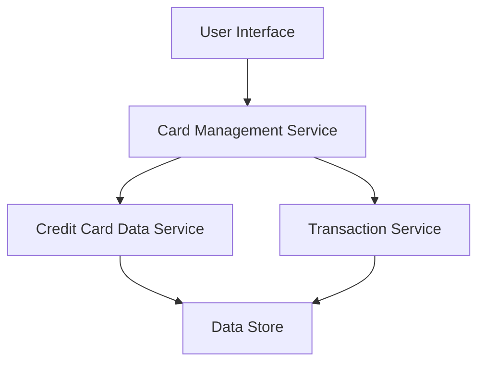

#### 1. High-Level Design

- **Summary:** This epic provides a consolidated multi-card management interface that allows users to view, manage, and analyze multiple credit cards (up to 20) within a single unified dashboard. Users can access card-specific details, perform card-wise spend analysis, view utilization metrics, and compare card usage patterns to optimize rewards and maintain better portfolio control.

- **Component Flow:**

- **Integration Points:**
  - **Upstream:** Credit Card Data Service (provides card information, balances, limits, and card details)
  - **Upstream:** Transaction Service (provides card-specific spending data for analysis)
  - **Downstream:** User Interface (displays consolidated card view and analytics)

- **Key Assumptions:**
  - Card data is synchronized in near real-time from Credit Card Data Service with 3-second SLA
  - Each card has a unique identifier that links transactions to specific cards for spend analysis

- **NFR Highlights:** System must support up to 20 credit cards per user; Card data synchronization must occur within 3 seconds; Interface must maintain performance with multiple cards loaded

- **Data Flow:** User accesses multi-card dashboard → Card Management Service retrieves card details from Credit Card Data Service → Service fetches card-specific transaction data from Transaction Service → Data is aggregated and processed for utilization metrics and comparison → Consolidated view with card-wise analytics is rendered in User Interface with drill-down capabilities for individual card details

#### 2. Validation Report

- **Requirements Coverage:** The design addresses all requirements including multiple credit card display, card-wise spend analysis, card details view, utilization metrics, and comparison features. The architecture supports the NFR of managing up to 20 cards per user with 3-second synchronization and performance maintenance. Dependencies on Credit Card Data Service and Transaction Service are properly integrated into the design. The component flow ensures efficient data retrieval and aggregation for the consolidated interface.