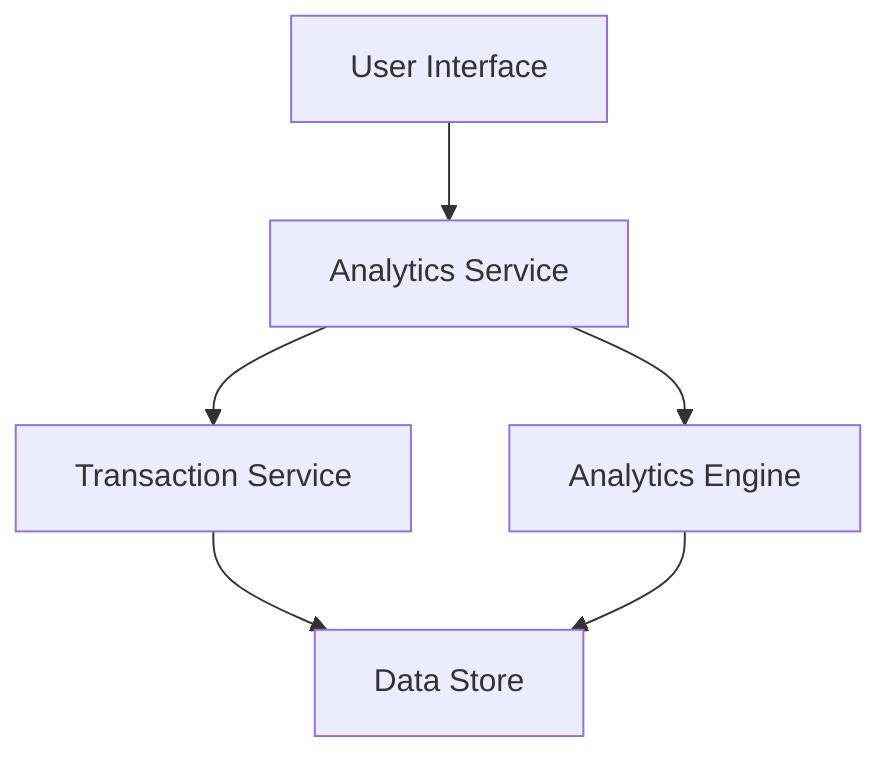

#### 1. High-Level Design

- **Summary:** This epic delivers interactive spending analytics capabilities that enable users to visualize and understand their credit card spending patterns. The solution provides monthly trend analysis and category-based spending breakdown across 9 predefined categories (Food & Dining, Fuel, Shopping, Travel, Entertainment, Utilities, Healthcare, Education, Miscellaneous), helping users make data-driven financial decisions.

- **Component Flow:**

- **Integration Points:**
  - **Upstream:** Transaction Service (provides transaction data and categorization)
  - **Upstream:** Analytics Engine (performs trend calculation and visualization generation)
  - **Downstream:** User Interface (renders interactive charts and visualizations)

- **Key Assumptions:**
  - Transaction categorization is performed by the Transaction Service using predefined rules or ML models
  - Historical data is retained for at least 12 months and is readily accessible for analytics queries

- **NFR Highlights:** Analytics visualizations must render within 3 seconds; System must handle 12 months of transaction history; Charts must be interactive and responsive across all device types

- **Data Flow:** User requests spending analytics → Analytics Service queries Transaction Service for categorized transaction data → Analytics Engine processes data to calculate monthly trends and category totals → Processed data is returned to Analytics Service → Interactive visualizations are rendered in the User Interface with filtering and drill-down capabilities

#### 2. Validation Report

- **Requirements Coverage:** The design fully covers the epic's stated scope including monthly spend trends visualization, category-wise spending analysis across 9 categories, interactive charts, spending pattern identification, and transaction categorization. The architecture supports the NFRs for 3-second rendering, 12-month history handling, and responsive design across devices. Integration dependencies with Transaction Service and Analytics Engine are clearly identified and incorporated into the component flow.