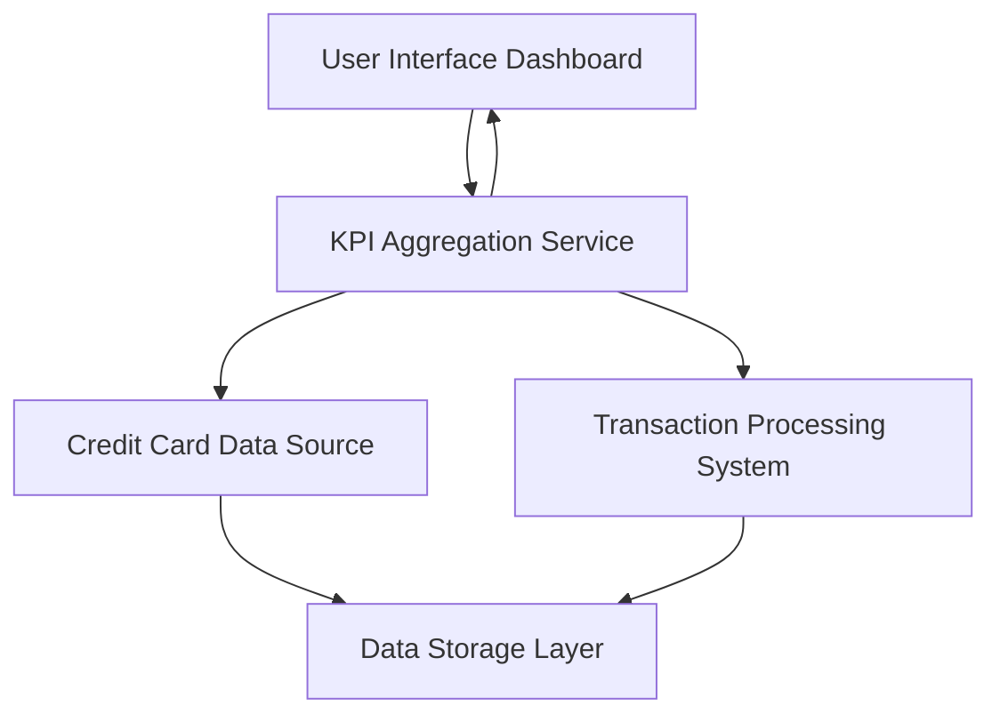

#### 1. High-Level Design

- **Summary**: This epic delivers a consolidated dashboard interface that aggregates and displays key performance indicators (KPIs) across multiple credit cards. The core requirement is to provide users with a unified view of their credit card portfolio, including monthly spend, total credit limit, available credit, and outstanding amounts. The scope encompasses data aggregation from multiple card sources, real-time calculation of financial metrics, and responsive presentation across all device types.

- **Component Flow**:

- **Integration Points**: 
  - **Upstream**: Credit card data sources for retrieving card details, balances, and credit limits
  - **Upstream**: Transaction processing system for monthly spend calculations and transaction data
  - **Downstream**: Dashboard UI components for rendering KPIs and visualizations

- **Key Assumptions**: 
  - Credit card data sources provide standardized API responses with card balance, limit, and outstanding amount fields
  - Monthly spend is calculated as sum of all transactions within the current calendar month

- **NFR Highlights**: Dashboard must load within 2 seconds; must support responsive layouts across desktop, tablet, and mobile devices; data refresh rate must be near real-time

- **Data Flow**: User requests dashboard → KPI Aggregation Service fetches card details from Credit Card Data Source and monthly spend from Transaction Processing System → Service aggregates data (calculates available credit, sums limits, consolidates outstanding amounts) → Processed KPIs returned to UI → Dashboard renders consolidated view with monthly spend, total credit limit, available credit, and outstanding amounts for all cards

#### 2. Validation Report

- **Requirements Coverage**: The design fully covers the epic's stated scope including dashboard KPIs display, monthly spend tracking, total credit limit aggregation, available credit calculation, outstanding amount monitoring, multiple credit card view, and consolidated card overview interface. All NFRs (2-second load time, responsive design, near real-time refresh) are addressed through the architecture. Integration dependencies with credit card data sources and transaction processing system are explicitly mapped in the component flow.